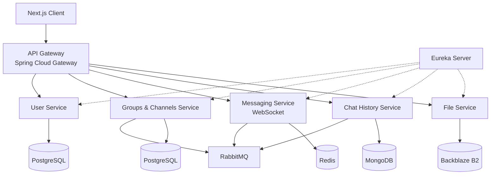

<div align="center">

# 💬 MiniDiscord

**A full-stack Discord clone built with Java Microservices & Next.js**

Real-time chat · Microservices architecture · Cloud-native deployment

[](https://github.com/PhatNguyenTT2/MiniDiscord/actions/workflows/deploy-backend.yml)

[Live Demo](https://minidiscord.vercel.app) · [API Endpoint](https://api.tuelord.site) · [Documentation](docs/)

</div>

---

## 🎯 Overview

MiniDiscord is a **multi-user chat server** inspired by Discord, designed as a microservices system with real-time WebSocket communication. The project demonstrates enterprise-grade patterns including service discovery, API gateway routing, JWT authentication, and automated CI/CD pipelines — all deployed on cloud infrastructure.

### Architecture at a Glance

```
┌──────────────────────────────────────────────────────────────────┐
│                        PRODUCTION FLOW                           │
│                                                                  │
│  Browser → Vercel CDN (Next.js SSR)                             │
│               │                                                  │
│               ▼  HTTPS                                           │
│  ┌─── DigitalOcean Droplet (2GB RAM) ──────────────────────┐    │
│  │                                                          │    │
│  │  Nginx (SSL Termination via Let's Encrypt)              │    │
│  │    └──→ Docker Compose Network                          │    │
│  │           ├── Eureka Server (Service Discovery)         │    │
│  │           ├── API Gateway (CORS, JWT, Rate Limiting)    │    │
│  │           ├── User Service (Auth, Profile CRUD)         │    │
│  │           └── Redis (Rate Limit Cache)                  │    │
│  └──────────────────────────────────────────────────────────┘    │
│               │                                                  │
│               ▼                                                  │
│  Supabase PostgreSQL (Managed Database)                         │
└──────────────────────────────────────────────────────────────────┘
```

---

## ✨ Features

### Authentication & Users
- 📧 Email/Password registration and login
- 🔐 Google OAuth 2.0 integration
- 🎫 JWT-based stateless authentication
- 👤 User profile management (avatar, status, username)

### API Gateway
- 🚦 Centralized routing with Spring Cloud Gateway
- 🔍 Eureka-based service discovery with `lb://` load-balanced routing
- 🛡️ Global JWT authentication filter with route whitelisting
- ⚡ Redis-backed IP/User-ID rate limiting (20 req/10s, fail-open)
- 🌐 Dynamic CORS with origin patterns for Vercel preview deployments

### Infrastructure & DevOps
- 🐳 Dockerized microservices with multi-stage builds (~180MB per image)
- 🔄 Automated CI/CD via GitHub Actions → GHCR → SSH deploy
- 🔒 Security-hardened: UFW firewall, `127.0.0.1` Docker binding, SSL termination
- 📊 Memory-budgeted deployment with container resource limits
- ♻️ Zero-downtime deployments with SHA-tagged rollback support

### Frontend
- ⚡ Next.js with App Router and Server-Side Rendering
- 🎨 Discord-accurate UI layout with dark theme
- 🌍 Internationalization (i18n) support
- 📱 Responsive design
- 🗃️ Zustand state management

---

## 🛠️ Tech Stack

| Layer | Technology | Purpose |
|-------|-----------|---------|
| **Frontend** | Next.js 14+, TypeScript, Zustand | SSR, state management |
| **API Gateway** | Spring Cloud Gateway (Reactive) | Routing, auth, rate limiting |
| **Service Discovery** | Netflix Eureka | Dynamic service registration |
| **Auth & Users** | Spring Boot 3.x, Spring Security 6 | JWT, Google OAuth, BCrypt |
| **Database** | Supabase (PostgreSQL 15+) | Managed relational data |
| **Cache** | Redis 7 (Docker container) | Rate limiting, session cache |
| **Shared Library** | `common-lib` (Maven module) | JwtUtil, ApiResponse, BaseException |
| **CI/CD** | GitHub Actions | Build, push GHCR, SSH deploy |
| **Infrastructure** | DigitalOcean Droplet, Nginx, Certbot | Hosting, SSL, reverse proxy |
| **Frontend Hosting** | Vercel | CDN, auto-deploy, preview URLs |

---

## 📁 Project Structure

```
MiniDiscord/
├── frontend/                      # Next.js application
│   ├── app/                       # App Router pages
│   ├── components/                # React components
│   ├── stores/                    # Zustand stores
│   └── lib/                       # API client, utilities
│
├── backend/                       # Java Microservices (Maven multi-module)
│   ├── common-lib/                # Shared DTOs, JwtUtil, exceptions
│   ├── discovery-server/          # Eureka Server (:8761)
│   ├── config-server/             # Spring Cloud Config (:8888)
│   ├── api-gateway/               # Spring Cloud Gateway (:8080)
│   ├── user-service/              # Auth & User CRUD (:8081)
│   ├── group-channel-service/     # Rooms & Channels (:8082)
│   ├── chat-history-service/      # Message storage - MongoDB (:8083)
│   ├── messaging-service/         # WebSocket real-time (:8084)
│   ├── file-service/              # File upload - Backblaze B2 (:8085)
│   ├── docker-compose.yml         # Local development
│   └── docker-compose.prod.yml    # Production (DigitalOcean)
│
├── .github/workflows/
│   └── deploy-backend.yml         # CI/CD: Build → GHCR → SSH Deploy
│
└── docs/
    ├── plan.md                    # Master architecture plan
    ├── progress.md                # Development progress tracker
    └── deploy/                    # Deployment documentation
        ├── report.md              # Full deployment report
        ├── devops_deep_dive.md    # Code-level DevOps explanation
        └── infrastructure_verification.md
```

---

## 🚀 Getting Started

### Prerequisites

- Java 17+
- Maven 3.9+
- Node.js 18+
- Docker & Docker Compose

### Local Development

**1. Backend**

```bash
cd backend

# Start infrastructure (Redis, Eureka)
docker compose up redis discovery-server -d

# Build and run services
mvn clean install -DskipTests
mvn -pl user-service spring-boot:run
mvn -pl api-gateway spring-boot:run
```

**2. Frontend**

```bash
cd frontend
npm install
cp .env.example .env.local
# Edit .env.local with your API URL
npm run dev
```

Open [http://localhost:3000](http://localhost:3000) to see the app.

### Environment Variables

| Variable | Service | Description |
|----------|---------|-------------|
| `SPRING_DATASOURCE_URL` | User Service | PostgreSQL JDBC URL |
| `JWT_SECRET` | Gateway + User | Shared JWT signing key |
| `CORS_ORIGINS` | Gateway | Allowed frontend origins |
| `GOOGLE_CLIENT_ID` | User Service | Google OAuth client ID |
| `NEXT_PUBLIC_API_URL` | Frontend | Backend API base URL |

---

## 🏗️ Microservices Architecture

### Service Communication



### Database Design

| Data Type | Database | Rationale |
|-----------|----------|-----------|
| Users, Rooms, Memberships | **PostgreSQL** | Relational data with ACID transactions, complex JOINs |
| Chat Messages | **MongoDB** | Write-heavy, flexible schema, horizontal sharding by `roomId` |
| Connection State, Cache | **Redis** | In-memory, ultra-low latency for presence and rate limiting |
| Files & Media | **Backblaze B2** | S3-compatible object storage, cost-effective |

### Concurrency Patterns

| Scenario | Strategy | Implementation |
|----------|----------|----------------|
| WebSocket sessions | `ConcurrentHashMap` | Lock-free reads, atomic `putIfAbsent` |
| Message fan-out | `@Async` + `CompletableFuture` | Non-blocking parallel delivery |
| Room member operations | Redis Distributed Lock | Prevents duplicate membership race conditions |
| User profile updates | JPA `@Version` | Optimistic locking with conflict detection |
| Rate limiting | Redis Lua Script | Atomic increment with sliding window |

---

## 🔒 Security

| Layer | Mechanism |
|-------|-----------|
| **Network** | UFW firewall (ports 22/80/443 only), Docker `127.0.0.1` binding |
| **Transport** | TLS 1.3 via Let's Encrypt auto-renewing certificates |
| **Authentication** | JWT tokens with configurable expiry, Google OAuth 2.0 |
| **Authorization** | Global `JwtAuthFilter` with route-based whitelisting |
| **Rate Limiting** | IP-based (anonymous) / User-ID-based (authenticated), fail-open design |
| **CORS** | Dynamic origin patterns, `HIGHEST_PRECEDENCE` filter ordering |
| **Secrets** | `.env` files excluded via `.gitignore`, no credentials in repository |

---

## 🔮 Roadmap

### Upcoming Features

| Feature | Description | Architecture |
|---------|-------------|--------------|
| **Group Chat Rooms** | Create/join rooms, channels, member management | `group-channel-service` + PostgreSQL |
| **Real-time Messaging** | WebSocket STOMP protocol, typing indicators | `messaging-service` + Redis + RabbitMQ |
| **Chat History** | Persistent message storage, cursor pagination, search | `chat-history-service` + MongoDB Atlas |
| **File Sharing** | Image/file upload with presigned URLs | `file-service` + Backblaze B2 |
| **Voice/Video Calls** | WebRTC peer-to-peer with signaling server | Leveraging existing WebSocket infrastructure |
| **Message Reactions** | Emoji reactions with embedded document arrays | MongoDB embedded sub-documents |
| **User Presence** | Online/Offline/Idle/DND status tracking | Redis ephemeral keys with TTL |
| **Push Notifications** | Firebase Cloud Messaging for mobile | Dedicated notification service |

---

## 📊 API Reference

### REST Endpoints

| Method | Endpoint | Description | Auth |
|--------|----------|-------------|------|
| `POST` | `/api/auth/register` | Register new account | No |
| `POST` | `/api/auth/login` | Login with credentials | No |
| `POST` | `/api/auth/google` | Google OAuth login | No |
| `GET` | `/api/users/me` | Get current user profile | JWT |
| `PUT` | `/api/users/me` | Update profile | JWT |
| `GET` | `/actuator/health` | Service health check | No |

### Response Format

All API responses follow a standardized format:

```json
{
  "success": true,
  "message": "Operation successful",
  "data": { ... },
  "timestamp": "2026-05-11T15:00:00",
  "errorCode": null
}
```

---

## 📄 Documentation

| Document | Description |
|----------|-------------|
| [Master Plan](docs/plan.md) | Full architecture, database design, concurrency patterns |
| [Deployment Report](docs/deploy/report.md) | Production configuration and troubleshooting |
| [DevOps Deep Dive](docs/deploy/devops_deep_dive.md) | Line-by-line code explanation of the deployment pipeline |
| [Infrastructure Verification](docs/deploy/infrastructure_verification.md) | Step-by-step server setup and verification guide |

---

## 👨‍💻 Author

**Phat Nguyen** — [GitHub](https://github.com/PhatNguyenTT2)

---

<div align="center">

Built with ☕ Java · ⚛️ React · 🐳 Docker · ☁️ DigitalOcean

</div>
