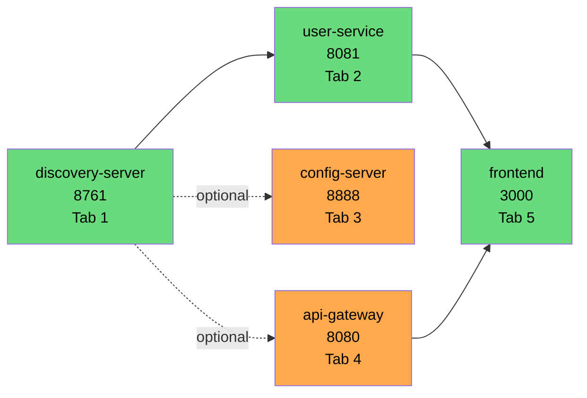

# 🚀 Discord Mini — Hướng Dẫn Khởi Chạy Chi Tiết

> **Mục tiêu:** Một người mới clone repo có thể chạy được service đầu tiên trong **< 10 phút**, không cần hỏi thêm.
> **Cập nhật:** 2026-05-07 | **Áp dụng cho phase:** P0 + P1A đã hoàn thành code
> **Môi trường tham chiếu:** Windows 11 + PowerShell 5.1 + JDK 17+ + Maven 3.9+

---

## 📚 Mục lục

1. [Tổng quan & Trạng thái runnable](#1--tổng-quan--trạng-thái-runnable)
2. [Yêu cầu môi trường](#2--yêu-cầu-môi-trường)
3. [Cấu trúc & vai trò 9 services](#3--cấu-trúc--vai-trò-9-services)
4. [Cơ chế nạp biến môi trường từ `.env`](#4--cơ-chế-nạp-biến-môi-trường-từ-env)
5. [Khởi động Backend (Local Dev)](#5--khởi-động-backend-local-dev)
6. [Khởi động Frontend](#6--khởi-động-frontend)
7. [Verify End-to-End (5 test cases)](#7--verify-end-to-end-5-test-cases)
8. [Dừng services](#8--dừng-services)
9. [Troubleshooting](#9--troubleshooting)
10. [Phụ lục](#10--phụ-lục)

---

## 1. 🎯 Tổng quan & Trạng thái runnable

Hiện tại chỉ có **2 service backend** chạy được full flow. Các service còn lại mới có Application class — start thì OK nhưng không có endpoint nào để gọi.

| # | Service | Port | Runnable? | Ghi chú |
|---|---------|------|-----------|---------|
| 1 | discovery-server | 8761 | 🟢 **OK** | Eureka standalone, không cần `.env` |
| 2 | config-server | 8888 | 🟢 OK | Cần Eureka nhưng không cần `.env` |
| 3 | **user-service** | 8081 | 🟢 **OK — full auth flow** | Có Register/Login/JWT/Profile |
| 4 | api-gateway | 8080 | 🟡 Start được | Routes pass-through, **chưa có JWT filter** (chờ Phase P1B) |
| 5 | group-channel-service | 8082 | 🔴 Chỉ start, không có endpoint | Chỉ Application class — chờ Phase P2 |
| 6 | chat-history-service | 8083 | 🔴 Chỉ start, không có endpoint | Chờ Phase P3 |
| 7 | messaging-service | 8084 | 🔴 Chỉ start, không có endpoint | Chờ Phase P4 |
| 8 | file-service | 8085 | 🔴 Chỉ start, không có endpoint | Chờ Phase P5 |
| 9 | **frontend** (Next.js) | 3000 | 🟢 OK — UI 70% | Vẫn dùng mock data ở nhiều nơi |

> **Kết luận thực tế:** Để chạy thử backend đầu cuối, chỉ cần `discovery-server` + `user-service`. Những phần khác để dành cho các phase tiếp theo.

---

## 2. ⚙️ Yêu cầu môi trường

| Công cụ | Phiên bản tối thiểu | Khuyến nghị | Kiểm tra |
|---------|---------------------|-------------|----------|
| **JDK** | 17 | Eclipse Temurin 17 hoặc 21 | `java -version` |
| **Maven** | 3.9 | 3.9.14 | `mvn -version` |
| **Node.js** | 20 LTS | 22 LTS | `node -v` |
| **npm** | đi kèm Node | — | `npm -v` |
| **PowerShell** | 5.1 (sẵn Windows) | 7+ cũng OK | `$PSVersionTable.PSVersion` |
| **Git** | 2.40+ | latest | `git --version` |

### Kiểm tra môi trường nhanh

```powershell
# Chạy 1 lượt — phải in ra 4 dòng version
java -version
mvn -version
node -v
$PSVersionTable.PSVersion
```

### Xác nhận `JAVA_HOME` trỏ đúng JDK 17+

```powershell
# Đọc JAVA_HOME (machine scope)
[System.Environment]::GetEnvironmentVariable("JAVA_HOME", "Machine")

# Đọc JAVA_HOME hiện tại của session
$env:JAVA_HOME
```

> ⚠️ Nếu `mvn -version` báo "JAVA_HOME does not point to a JDK" → Kiểm tra biến môi trường: trỏ đến `C:\Program Files\Java\jdk-17.x.x` (KHÔNG phải `\bin`, KHÔNG phải JRE). Sau khi sửa, **mở terminal mới**.
>
> 💡 JDK > 17 (vd JDK 21, 26) **vẫn chạy được** vì target bytecode trong [`backend/pom.xml`](../backend/pom.xml) đặt `<java.version>17</java.version>` — Maven sẽ compile ra class file Java 17.

---

## 3. 📁 Cấu trúc & vai trò 9 services

```
d:\MiniDiscord\
├── backend\                 # Maven multi-module (Spring Boot 3.4.4)
│   ├── pom.xml              # Parent POM
│   ├── .env.example         # Template biến môi trường
│   ├── common-lib\          # Shared: ApiResponse, JwtUtil, BaseException
│   ├── discovery-server\    # 🟢 Eureka 8761
│   ├── config-server\       # 🟢 Spring Cloud Config 8888
│   ├── api-gateway\         # 🟡 Spring Cloud Gateway 8080
│   ├── user-service\        # 🟢 Auth + User CRUD 8081 (.env Supabase)
│   ├── group-channel-service\  # 🔴 Room/Channel CRUD 8082 (.env Supabase + RMQ)
│   ├── chat-history-service\   # 🔴 Message Storage 8083 (.env MongoDB + RMQ)
│   ├── messaging-service\      # 🔴 WebSocket 8084 (.env Redis + RMQ)
│   └── file-service\           # 🔴 Upload 8085 (.env B2)
│
├── frontend\                # Next.js 16.2.1 (App Router) — 🟢 npm run dev
│   ├── package.json
│   ├── app\, components\, hooks\, stores\, lib\, types\
│   └── ...
│
└── docs\
    ├── plan.md              # Master plan kiến trúc
    ├── progress.md          # Tiến độ chi tiết theo file
    ├── phase-p0-p1a.md      # Plan + test plan Phase P0+P1A
    ├── phase-p0-p1a-report.md  # Báo cáo line-by-line
    ├── phase-p1b.md         # Kế hoạch Phase tiếp theo
    └── how-to-start.md      # ← Bạn đang đọc
```

### Bảng cloud provider per service

| Service | DB | Cloud | Region | Cần `.env`? |
|---------|----|----|--------|-------------|
| user-service | PostgreSQL | Supabase | ap-southeast-2 | ✅ |
| group-channel-service | PostgreSQL | Supabase | ap-northeast-1 | ✅ |
| chat-history-service | MongoDB | Atlas | — | ✅ |
| messaging-service | Redis + RMQ | Upstash + CloudAMQP | global | ✅ |
| file-service | Object | Backblaze B2 | — | ✅ |
| api-gateway | — | — | — | ✅ (JWT secret + Eureka URL) |
| discovery-server | — | — | — | ❌ |
| config-server | — | — | — | ❌ |

---

## 4. 🔐 Cơ chế nạp biến môi trường từ `.env`

### Vấn đề cốt lõi

> **Spring Boot KHÔNG tự đọc file `.env`.** Khi `application.yml` có `${DB_URL:default}`, Spring Boot lấy giá trị từ **OS environment variables** hoặc fallback sang `default`.

→ Nếu bạn chỉ `mvn spring-boot:run` thì service sẽ kết nối tới `localhost:5432` (default) — không phải Supabase, và sẽ fail.

### Pattern chuẩn — Script `run-with-env.ps1`

Trong [`backend/user-service/run-with-env.ps1`](../backend/user-service/run-with-env.ps1) đã có sẵn pattern:

```powershell
Get-Content "$PSScriptRoot\.env" | Where-Object { $_ -match '^[A-Z][A-Z0-9_]*=' } | ForEach-Object {
    $kv = $_ -split '=', 2
    [System.Environment]::SetEnvironmentVariable($kv[0], $kv[1], 'Process')
}
Set-Location $PSScriptRoot
mvn -q spring-boot:run
```

### Giải thích từng dòng

| Dòng | Hành động | Lý do |
|------|-----------|-------|
| 1 | Đọc tất cả dòng dạng `KEY=VALUE` (bỏ comment) | Regex `^[A-Z][A-Z0-9_]*=` lọc đúng định dạng env var |
| 2 | Tách key/value bằng dấu `=` đầu tiên (limit 2) | Cho phép value chứa `=` (vd `RABBITMQ_PASS=qp_=Mxz`) |
| 3 | `SetEnvironmentVariable(... 'Process')` | Chỉ nạp vào process scope — **không ảnh hưởng máy/user khác** |
| 5 | `Set-Location $PSScriptRoot` | Chạy mvn trong đúng thư mục module |
| 6 | `mvn -q spring-boot:run` | Chạy service, kế thừa env vars vừa nạp |

### Tạo script tương tự cho service khác

Khi bạn implement xong group-channel/chat-history/messaging/file service, **copy file `run-with-env.ps1` sang folder tương ứng** — script tự dùng `$PSScriptRoot` nên không cần sửa gì.

```powershell
# Ví dụ: clone helper sang group-channel-service
Copy-Item backend\user-service\run-with-env.ps1 backend\group-channel-service\
```

### ⚠️ Bảo mật

- File `.env` **đã được `.gitignore`** — không commit lên Git
- Mỗi service có `.env` riêng theo nguyên tắc least-privilege (user-service không cần biết RabbitMQ creds của messaging-service)
- Khi chia sẻ project, gửi file `.env` qua kênh riêng (1Password, Bitwarden, Slack DM) — không qua email/chat group

---

## 5. 🚀 Khởi động Backend (Local Dev)

### 5.1 Build lần đầu

```powershell
# Từ root project
Set-Location d:\MiniDiscord\backend

# Chỉ build 2 module cần dùng — KHÔNG build full vì các service khác sẽ fail
mvn -pl common-lib,user-service -am install
```

> **Vì sao chỉ build 2 module?** Các service P2-P5 chưa được implement đầy đủ — `mvn install` toàn bộ có thể vẫn pass (vì chưa có code business logic), nhưng tốn thời gian. Build có chọn lọc nhanh hơn.
>
> **Khi nào cần `mvn install` cho `common-lib`?** Lần đầu, hoặc mỗi khi sửa code trong `common-lib` (vì user-service phụ thuộc artifact đã install vào local repo `~/.m2`).

### 5.2 Sơ đồ thứ tự khởi động



### 5.3 Tab 1 — Khởi động discovery-server (Eureka)

```powershell
Set-Location d:\MiniDiscord\backend\discovery-server
mvn spring-boot:run
```

Chờ log xuất hiện:
```
Started DiscoveryServerApplication in X.XXX seconds
```

**Verify:** Mở trình duyệt → http://localhost:8761 → Thấy Eureka Dashboard (chưa có instance nào).

### 5.4 Tab 2 — Khởi động user-service

**Cách 1 — Dùng helper script (khuyến nghị):**

```powershell
Set-Location d:\MiniDiscord\backend\user-service
.\run-with-env.ps1
```

**Cách 2 — Inline (không cần file `.ps1`):**

```powershell
Set-Location d:\MiniDiscord\backend\user-service

# Nạp .env vào process env vars
Get-Content .\.env | Where-Object { $_ -match '^[A-Z][A-Z0-9_]*=' } | ForEach-Object {
    $kv = $_ -split '=', 2
    [System.Environment]::SetEnvironmentVariable($kv[0], $kv[1], 'Process')
}

# Run
mvn spring-boot:run
```

Chờ log:
```
Started UserServiceApplication in X.XXX seconds
```

**Verify:**
- Tab 1 (Eureka) refresh → mục "Instances currently registered with Eureka" có **USER-SERVICE**
- Hoặc gọi nhanh:
  ```powershell
  Invoke-RestMethod http://localhost:8081/actuator/health -ErrorAction SilentlyContinue
  ```

### 5.5 (Optional) Tab 3 — api-gateway

```powershell
Set-Location d:\MiniDiscord\backend\api-gateway

# api-gateway có .env (chỉ JWT_SECRET + EUREKA_URL)
Get-Content .\.env | Where-Object { $_ -match '^[A-Z][A-Z0-9_]*=' } | ForEach-Object {
    $kv = $_ -split '=', 2
    [System.Environment]::SetEnvironmentVariable($kv[0], $kv[1], 'Process')
}

mvn spring-boot:run
```

> ⚠️ **Lưu ý:** Phase **P1B chưa implement** → Gateway hiện chỉ làm pass-through, **không validate JWT**. Bạn có thể gọi qua port 8080 hoặc gọi thẳng port 8081, kết quả như nhau cho user-service.

### 5.6 Verify Eureka registry

Mở http://localhost:8761 → Section **Instances currently registered with Eureka** phải có:

| Application | Status |
|-------------|--------|
| USER-SERVICE | UP (1) |
| API-GATEWAY (nếu đã start) | UP (1) |

---

## 6. 🎨 Khởi động Frontend

> Frontend dùng **Next.js 16.2.1** — đây là phiên bản mới có breaking changes so với Next 14/15. Nếu cần tham chiếu API mới, đọc `frontend/node_modules/next/dist/docs/`.

### Lần đầu: cài dependencies

```powershell
Set-Location d:\MiniDiscord\frontend
npm install
```

### Mỗi lần dev

```powershell
Set-Location d:\MiniDiscord\frontend
npm run dev
```

Mở http://localhost:3000 → Discord-style UI hiển thị.

> 💡 Frontend hiện đang **dùng mock data** ở nhiều chỗ. Khi backend chưa lên, vẫn xem được layout. Khi backend lên, các integration cần được bật theo từng phase.

---

## 7. ✅ Verify End-to-End (5 test cases)

Trước khi chạy, đảm bảo `discovery-server` + `user-service` đang up. Tất cả lệnh dưới chạy ở **Tab 5 (PowerShell mới)**.

### Test 1 — Đăng ký tài khoản

```powershell
$body = @{
    username = "testuser"
    email    = "testuser@example.com"
    password = "Test@123456"
} | ConvertTo-Json

Invoke-RestMethod -Uri http://localhost:8081/api/auth/register `
    -Method Post -ContentType 'application/json' -Body $body
```

**Kỳ vọng:**
- HTTP 201 Created
- Response: `success=true`, `data.token=<JWT>`, `data.user.id=<UUID>`, `data.user.role="USER"`, `data.user.status="OFFLINE"`

### Test 2 — Đăng nhập + lưu token

```powershell
$body = @{
    email    = "testuser@example.com"
    password = "Test@123456"
} | ConvertTo-Json

$resp = Invoke-RestMethod -Uri http://localhost:8081/api/auth/login `
    -Method Post -ContentType 'application/json' -Body $body

$token = $resp.data.token
Write-Host "Token: $token"
```

**Kỳ vọng:** HTTP 200, `data.token` là chuỗi JWT 3 phần.

### Test 3 — Gọi API bảo vệ KHÔNG có token (expect 401)

```powershell
try {
    Invoke-RestMethod http://localhost:8081/api/users/me
} catch {
    Write-Host "Status: $($_.Exception.Response.StatusCode.value__)"
}
```

**Kỳ vọng:** Status `401`.

### Test 4 — Gọi với Bearer token (expect 200)

```powershell
$headers = @{ Authorization = "Bearer $token" }

Invoke-RestMethod -Uri http://localhost:8081/api/users/me `
    -Headers $headers
```

**Kỳ vọng:** HTTP 200, `data.username="testuser"`, `data.email="testuser@example.com"`.

### Test 5 — Cập nhật profile

```powershell
$body = @{ username = "newusername" } | ConvertTo-Json

Invoke-RestMethod -Uri http://localhost:8081/api/users/me `
    -Method Put -Headers $headers -ContentType 'application/json' -Body $body
```

**Kỳ vọng:** HTTP 200, `data.username="newusername"`, email không đổi.

### Bảng tổng hợp

| # | Test | Endpoint | Expected | Status |
|---|------|----------|----------|--------|
| 1 | Register | POST `/api/auth/register` | 201 + token | ⏳ |
| 2 | Login | POST `/api/auth/login` | 200 + token | ⏳ |
| 3 | No token | GET `/api/users/me` | 401 | ⏳ |
| 4 | Bearer token | GET `/api/users/me` | 200 + user | ⏳ |
| 5 | Update profile | PUT `/api/users/me` | 200 + updated | ⏳ |

> Khi cả 5 pass → Phase P0+P1A hoàn thành 100% (chuyển trạng thái docs từ ⚠️ "CHƯA VERIFY" sang ✅ "VERIFIED").

---

## 8. 🛑 Dừng services

### Cách 1 — `Ctrl+C` từng terminal (khuyến nghị)

Nhấn `Ctrl+C` trong tab Maven đang chạy. Đợi shutdown hook chạy xong (~5s).

### Cách 2 — Kill tất cả java process

```powershell
# Liệt kê trước khi giết
Get-Process java -ErrorAction SilentlyContinue | Select-Object Id, ProcessName, StartTime

# Giết tất cả
Get-Process java -ErrorAction SilentlyContinue | Stop-Process -Force
```

> ⚠️ Lệnh này giết **mọi** JVM process, kể cả IDE đang dùng JVM (IntelliJ, Eclipse). Hãy `Ctrl+C` trước khi `Stop-Process`.

### Cách 3 — Kill theo port

```powershell
# Tìm PID đang nghe port 8081
$pid = (Get-NetTCPConnection -LocalPort 8081 -State Listen).OwningProcess
Stop-Process -Id $pid -Force
```

---

## 9. 🩺 Troubleshooting

| # | Triệu chứng | Nguyên nhân | Cách khắc phục |
|---|-------------|-------------|----------------|
| 1 | `Port 8761 already in use` | Eureka cũ chưa shutdown / app khác chiếm port | `Get-NetTCPConnection -LocalPort 8761 \| Select OwningProcess` → `Stop-Process -Id <pid>` |
| 2 | `mvn: JAVA_HOME does not point to a JDK` | `JAVA_HOME` trỏ JRE hoặc sai | Trỏ về thư mục JDK gốc (vd `C:\Program Files\Java\jdk-17`), KHÔNG có `\bin`. Mở terminal mới |
| 3 | `WeakKeyException: The signing key's size is too short` | `JWT_SECRET` < 256 bit | Dùng key dài ≥ 32 bytes (xem §10.D) |
| 4 | `IllegalArgumentException: Illegal base64 character` khi start user-service | `JWT_SECRET` chứa ký tự không hợp lệ Base64 (`-`, `_`, `@`, ...) | JJWT decode key bằng Base64 → đảm bảo `JWT_SECRET` là chuỗi Base64 hợp lệ. Sinh nhanh: xem §10.D |
| 5 | `HikariPool: Connection is not available` | Supabase pool chưa kết nối / sai credentials | Verify `DB_URL`, `DB_USERNAME`, `DB_PASSWORD` trong `.env`. Supabase có 2 port: `5432` (direct) hoặc `6543` (pooler). Test bằng `psql` hoặc Supabase Studio |
| 6 | `mvn spring-boot:run` chạy nhưng kết nối `localhost:5432` (DB sai) | `.env` chưa được load — bạn quên chạy `run-with-env.ps1` | Dùng `run-with-env.ps1`, hoặc kiểm tra trước khi mvn: `$env:DB_URL` phải in ra URL Supabase |
| 7 | Frontend lỗi `Module not found: zustand` | `npm install` chưa chạy | `cd frontend; npm install` |
| 8 | Lỗi CORS khi frontend gọi `localhost:8081` | Origin không nằm trong whitelist | Mở [`SecurityConfig.java`](../backend/user-service/src/main/java/com/discordmini/user/config/SecurityConfig.java#L51) — đã allow `localhost:3000` + `localhost:8080`. Nếu dev port khác → thêm origin |
| 9 | Service register Eureka nhưng status `DOWN` | Health check fail | Xem log Spring Boot trong tab → tìm exception cụ thể |
| 10 | JDK > 17 (vd 21, 26) — start báo warning | Spring Boot 3.4 chính thức hỗ trợ tới JDK 23 | Phần lớn warning là vô hại. Nếu lỗi nặng → downgrade về JDK 17 LTS |

### Verify nhanh đã nạp đúng `.env`

```powershell
# Sau khi chạy run-with-env.ps1 (hoặc inline) NHƯNG TRƯỚC khi mvn run:
$env:DB_URL          # Phải in URL Supabase
$env:JWT_SECRET      # Phải in JWT secret
$env:EUREKA_URL      # Phải in URL Eureka
```

---

## 10. 📎 Phụ lục

### A. Bảng port mapping

| Port | Service | Mở trình duyệt? |
|------|---------|-----------------|
| 3000 | frontend (Next.js) | ✅ http://localhost:3000 |
| 8080 | api-gateway | ❌ (gọi REST API) |
| 8081 | user-service | ❌ (gọi REST API) |
| 8082 | group-channel-service | ❌ |
| 8083 | chat-history-service | ❌ |
| 8084 | messaging-service | ❌ (WebSocket) |
| 8085 | file-service | ❌ |
| 8761 | discovery-server | ✅ http://localhost:8761 |
| 8888 | config-server | ❌ |

### B. Env vars cần thiết per service

| Service | Keys bắt buộc |
|---------|---------------|
| user-service | `DB_URL`, `DB_USERNAME`, `DB_PASSWORD`, `JWT_SECRET`, `EUREKA_URL` |
| group-channel-service | `DB_URL`, `DB_USERNAME`, `DB_PASSWORD`, `RABBITMQ_HOST`, `RABBITMQ_PORT`, `RABBITMQ_USER`, `RABBITMQ_PASS`, `RABBITMQ_VHOST`, `RABBITMQ_SSL`, `EUREKA_URL` |
| chat-history-service | `MONGODB_URI`, `RABBITMQ_*` (như trên), `EUREKA_URL` |
| messaging-service | `REDIS_HOST`, `REDIS_PORT`, `REDIS_PASSWORD`, `REDIS_SSL`, `RABBITMQ_*`, `JWT_SECRET`, `EUREKA_URL` |
| file-service | `B2_ENDPOINT`, `B2_KEY_ID`, `B2_APP_KEY`, `B2_BUCKET_NAME`, `EUREKA_URL` |
| api-gateway | `JWT_SECRET`, `EUREKA_URL` |

> Xem template gốc tại [`backend/.env.example`](../backend/.env.example).

### C. URLs hay dùng

| Mục đích | URL |
|----------|-----|
| Eureka Dashboard | http://localhost:8761 |
| User Service health | http://localhost:8081/actuator/health |
| Frontend dev | http://localhost:3000 |
| Supabase Studio | https://supabase.com/dashboard/project/wjczkrkbcqgkjpvupupb (project user-service) |
| Supabase Studio | https://supabase.com/dashboard/project/ocowvsmaijwyjbrffxzr (project group-channel) |
| MongoDB Atlas | https://cloud.mongodb.com |
| Upstash Console | https://console.upstash.com |
| CloudAMQP Console | https://customer.cloudamqp.com |
| Backblaze B2 Console | https://secure.backblaze.com/b2_buckets.htm |

### D. Snippet PowerShell hay dùng

#### D.1 — Sinh JWT secret hợp lệ Base64 (32 bytes)

```powershell
# 32 bytes ngẫu nhiên, encode Base64 → đảm bảo HMAC-SHA-256 + JJWT decode OK
$bytes = New-Object byte[] 32
[System.Security.Cryptography.RandomNumberGenerator]::Create().GetBytes($bytes)
[Convert]::ToBase64String($bytes)
```

Copy output → dán vào `JWT_SECRET=<output>` trong cả `.env` của user-service và api-gateway (phải khớp 100% giữa các service).

#### D.2 — Một-lệnh build + chạy user-service

```powershell
# Từ root project
Set-Location d:\MiniDiscord\backend
mvn -pl common-lib,user-service -am install -q
Set-Location user-service
.\run-with-env.ps1
```

#### D.3 — Helper kiểm tra services lên đủ chưa

```powershell
@(8761, 8081, 3000) | ForEach-Object {
    $port = $_
    $up = Get-NetTCPConnection -LocalPort $port -State Listen -ErrorAction SilentlyContinue
    $status = if ($up) { "🟢 UP" } else { "🔴 DOWN" }
    Write-Host "Port $port  $status"
}
```

#### D.4 — Tail log file (nếu chạy mvn redirect ra log)

```powershell
Get-Content d:\MiniDiscord\backend\user-service\runtime.log -Tail 30 -Wait
```

---

## 🔗 Tham chiếu

- [docs/plan.md](plan.md) — Kiến trúc tổng thể, DB design, concurrency patterns
- [docs/progress.md](progress.md) — Tiến độ chi tiết theo file
- [docs/phase-p0-p1a.md](phase-p0-p1a.md) — Plan + 5 test cases (gốc của §7)
- [docs/phase-p0-p1a-report.md](phase-p0-p1a-report.md) — Báo cáo line-by-line code đã viết
- [docs/phase-p1b.md](phase-p1b.md) — Phase tiếp theo (api-gateway JWT/CORS/rate limit)
