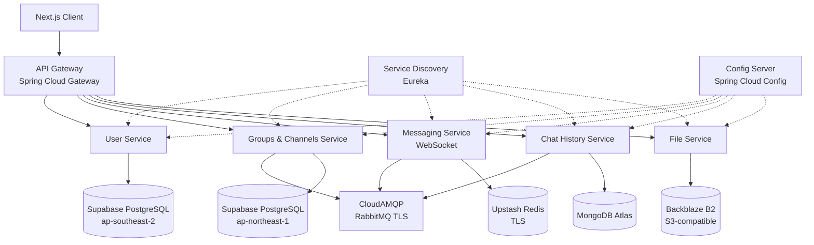
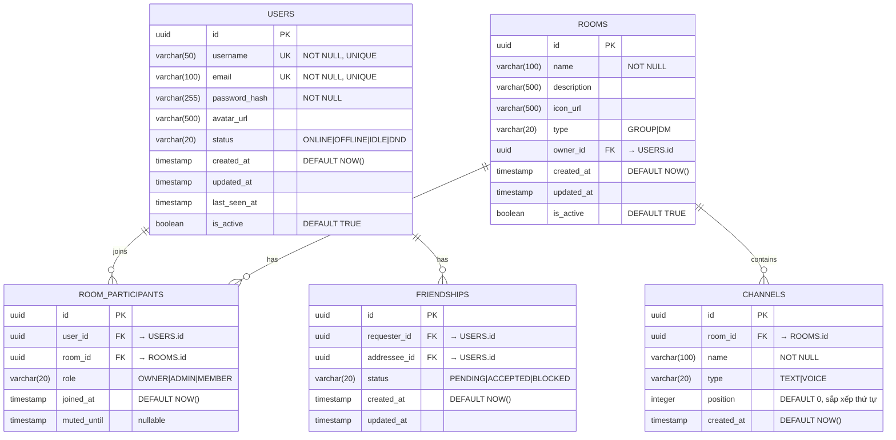

# 🎯 Discord Mini — Master Plan

> **Đề tài:** Xây dựng Chat Server đa người dùng (Mini Discord Clone)
> **Backend:** Java Spring Boot (Microservices) | **Frontend:** Next.js | **DB:** PostgreSQL + MongoDB + Redis
> **Infrastructure:** 100% Cloud — Supabase · MongoDB Atlas · Upstash · CloudAMQP · Backblaze B2

---

## 1. Kiến trúc tổng thể (Microservices Architecture)

Hệ thống sử dụng mô hình **Centralized Server** kết hợp **WebSocket** để duy trì kết nối 2 chiều liên tục, giảm thiểu độ trễ và tiết kiệm tài nguyên so với HTTP Polling.

### 1.1 Tổng quan Services



### 1.2 Mô tả các Microservices

| Service | Mô tả | Database / Infra | Cloud Provider | Port |
|---------|--------|------------------|----------------|------|
| **API Gateway** | Định tuyến request, xác thực JWT, Rate Limiting | — | — | 8080 |
| **Service Discovery** | Eureka Server — quản lý đăng ký/tìm kiếm service | — | — | 8761 |
| **Config Server** | Quản lý cấu hình tập trung | — | — | 8888 |
| **User Service** | Đăng ký, đăng nhập, quản lý hồ sơ, JWT token | PostgreSQL | **Supabase** (ap-southeast-2) | 8081 |
| **Groups & Channels Service** | CRUD Room/Channel, quản lý thành viên, phân quyền | PostgreSQL + RabbitMQ | **Supabase** (ap-northeast-1) + **CloudAMQP** | 8082 |
| **Chat History Service** | Đọc/Ghi lịch sử tin nhắn, tìm kiếm | MongoDB + RabbitMQ | **MongoDB Atlas** + **CloudAMQP** | 8083 |
| **Messaging Service** | WebSocket handler, STOMP, duy trì kết nối real-time | Redis + RabbitMQ | **Upstash** + **CloudAMQP** | 8084 |
| **File Service** | Upload/Download file, ảnh lên Backblaze B2 | Object Storage | **Backblaze B2** (S3-compatible) | 8085 |

---

## 2. Cấu trúc dự án (Project Structure)

### 2.1 Backend — Java Spring Boot (Microservices)

```
discord-mini-backend/
├── pom.xml                              # Parent POM (dependency management)
│
├── discovery-server/                    # Eureka Server
│   ├── src/main/java/.../
│   │   └── DiscoveryServerApplication.java
│   └── src/main/resources/
│       └── application.yml
│
├── config-server/                       # Spring Cloud Config
│   ├── src/main/java/.../
│   │   └── ConfigServerApplication.java
│   └── src/main/resources/
│       ├── application.yml
│       └── configurations/             # Config files per service
│
├── api-gateway/                         # Spring Cloud Gateway
│   ├── src/main/java/.../
│   │   ├── ApiGatewayApplication.java
│   │   ├── config/
│   │   │   ├── GatewayConfig.java       # Route definitions
│   │   │   ├── CorsConfig.java
│   │   │   └── RateLimitConfig.java     # Redis-based rate limiting
│   │   └── filter/
│   │       └── JwtAuthFilter.java       # JWT validation filter
│   └── src/main/resources/
│       └── application.yml
│
├── user-service/
│   ├── .env                             # Supabase PG + JWT credentials (git-ignored)
│   ├── src/main/java/.../
│   │   ├── UserServiceApplication.java
│   │   ├── controller/
│   │   │   ├── AuthController.java
│   │   │   └── UserController.java
│   │   ├── service/
│   │   │   ├── AuthService.java
│   │   │   ├── UserService.java
│   │   │   └── JwtService.java
│   │   ├── repository/
│   │   │   └── UserRepository.java      # JPA Repository
│   │   ├── model/
│   │   │   ├── entity/
│   │   │   │   ├── User.java            # @Entity
│   │   │   │   └── UserRole.java        # ENUM
│   │   │   ├── dto/
│   │   │   │   ├── LoginRequest.java
│   │   │   │   ├── RegisterRequest.java
│   │   │   │   └── UserResponse.java
│   │   │   └── mapper/
│   │   │       └── UserMapper.java
│   │   ├── config/
│   │   │   └── SecurityConfig.java      # Spring Security
│   │   └── exception/
│   │       ├── GlobalExceptionHandler.java
│   │       └── UserNotFoundException.java
│   └── src/main/resources/
│       └── application.yml
│
├── group-channel-service/
│   ├── .env                             # Supabase PG + CloudAMQP credentials (git-ignored)
│   ├── src/main/java/.../
│   │   ├── GroupChannelApplication.java
│   │   ├── controller/
│   │   │   ├── RoomController.java
│   │   │   └── ChannelController.java
│   │   ├── service/
│   │   │   ├── RoomService.java
│   │   │   └── MembershipService.java
│   │   ├── repository/
│   │   │   ├── RoomRepository.java
│   │   │   └── RoomParticipantRepository.java
│   │   ├── model/
│   │   │   ├── entity/
│   │   │   │   ├── Room.java
│   │   │   │   ├── RoomParticipant.java
│   │   │   │   └── RoomRole.java        # OWNER, ADMIN, MEMBER
│   │   │   └── dto/
│   │   │       ├── CreateRoomRequest.java
│   │   │       └── RoomResponse.java
│   │   └── event/
│   │       └── RoomEventPublisher.java  # RabbitMQ publisher
│   └── src/main/resources/
│       └── application.yml
│
├── chat-history-service/
│   ├── .env                             # MongoDB Atlas + CloudAMQP credentials (git-ignored)
│   ├── src/main/java/.../
│   │   ├── ChatHistoryApplication.java
│   │   ├── controller/
│   │   │   └── MessageController.java   # REST: lấy lịch sử
│   │   ├── service/
│   │   │   └── MessageService.java
│   │   ├── repository/
│   │   │   └── MessageRepository.java   # MongoRepository
│   │   ├── model/
│   │   │   ├── document/
│   │   │   │   └── Message.java         # @Document (MongoDB)
│   │   │   └── dto/
│   │   │       └── MessageResponse.java
│   │   └── listener/
│   │       └── MessageEventListener.java # RabbitMQ consumer
│   └── src/main/resources/
│       └── application.yml
│
├── messaging-service/
│   ├── .env                             # Upstash Redis + CloudAMQP credentials (git-ignored)
│   ├── src/main/java/.../
│   │   ├── MessagingApplication.java
│   │   ├── config/
│   │   │   ├── WebSocketConfig.java     # STOMP configuration
│   │   │   ├── RabbitMQConfig.java
│   │   │   └── RedisConfig.java
│   │   ├── controller/
│   │   │   └── ChatWebSocketController.java  # @MessageMapping
│   │   ├── service/
│   │   │   ├── ConnectionManager.java   # Redis: user↔server mapping
│   │   │   ├── MessageRouter.java       # Fan-out logic
│   │   │   └── PresenceService.java     # Online/offline tracking
│   │   ├── handler/
│   │   │   ├── WebSocketEventHandler.java    # Connect/Disconnect
│   │   │   └── StompErrorHandler.java
│   │   └── model/
│   │       └── dto/
│   │           ├── ChatMessage.java
│   │           └── TypingEvent.java
│   └── src/main/resources/
│       └── application.yml
│
├── file-service/
│   ├── .env                             # Backblaze B2 credentials (git-ignored)
│   ├── src/main/java/.../
│   │   ├── FileServiceApplication.java
│   │   ├── controller/
│   │   │   └── FileController.java
│   │   ├── service/
│   │   │   └── StorageService.java      # Backblaze B2 (S3-compatible) integration
│   │   └── config/
│   │       └── B2Config.java            # Backblaze B2 config (MinIO SDK)
│   └── src/main/resources/
│       └── application.yml
│
├── common-lib/                           # Shared library
│   ├── src/main/java/.../
│   │   ├── dto/
│   │   │   └── ApiResponse.java         # Chuẩn hóa response
│   │   ├── exception/
│   │   │   └── BaseException.java
│   │   ├── security/
│   │   │   └── JwtUtil.java
│   │   └── event/
│   │       └── MessageEvent.java        # Shared event classes
│   └── pom.xml
│
└── .env.example                          # Template — không chứa credentials thực
```

### 2.2 Frontend — Next.js

```
frontend/
├── package.json
├── next.config.ts
├── tsconfig.json
├── eslint.config.mjs
├── postcss.config.mjs
│
├── public/
│   └── assets/
│
├── app/                                 # App Router (Next.js 16+)
│   ├── globals.css                      # Global styles (Tailwind)
│   ├── layout.tsx                       # Root layout
│   ├── page.tsx                         # Landing page
│   ├── (auth)/
│   │   ├── login/page.tsx
│   │   └── register/page.tsx
│   └── (main)/
│       ├── layout.tsx                   # Sidebar + main area
│       ├── channels/
│       │   └── [channelId]/page.tsx     # Chat room view
│       └── dm/
│           └── [userId]/page.tsx        # Direct message view
│
├── components/
│   ├── ui/                              # Reusable primitives
│   │   ├── Button.tsx
│   │   ├── Input.tsx
│   │   ├── Avatar.tsx
│   │   └── Modal.tsx
│   ├── chat/
│   │   ├── MessageList.tsx
│   │   ├── MessageItem.tsx
│   │   ├── MessageInput.tsx
│   │   └── TypingIndicator.tsx
│   ├── sidebar/
│   │   ├── ServerList.tsx
│   │   ├── ChannelList.tsx
│   │   └── UserPanel.tsx
│   └── layout/
│       └── MainLayout.tsx
│
├── hooks/
│   ├── useWebSocket.ts                  # STOMP client hook
│   ├── useAuth.ts
│   └── useMessages.ts                   # Infinite scroll + real-time
│
├── lib/
│   ├── api.ts                           # Axios instance + interceptors
│   ├── websocket.ts                     # STOMP client setup
│   └── utils.ts
│
├── stores/                              # Zustand state management
│   ├── authStore.ts
│   ├── chatStore.ts
│   └── uiStore.ts
│
├── types/
│   ├── index.ts                         # Barrel export
│   ├── api.ts
│   ├── user.ts
│   ├── message.ts
│   └── room.ts
│
└── .env.local
```

---

## 3. System APIs (Giao diện hệ thống)

### 3.1 REST APIs

| Method | Endpoint | Service | Mô tả |
|--------|----------|---------|--------|
| `POST` | `/api/auth/login` | User | Đăng nhập → JWT Token |
| `POST` | `/api/auth/register` | User | Đăng ký tài khoản |
| `GET` | `/api/users/me` | User | Lấy thông tin user hiện tại |
| `PUT` | `/api/users/me` | User | Cập nhật hồ sơ |
| `POST` | `/api/rooms` | Groups & Channels | Tạo phòng chat mới |
| `GET` | `/api/rooms` | Groups & Channels | Danh sách phòng của user |
| `POST` | `/api/rooms/{id}/members` | Groups & Channels | Thêm thành viên |
| `DELETE` | `/api/rooms/{id}/members/{userId}` | Groups & Channels | Xóa thành viên |
| `GET` | `/api/rooms/{id}/messages?limit=50&before={cursor}` | Chat History | Lịch sử tin nhắn (cursor pagination) |
| `POST` | `/api/files/upload` | File | Upload file → URL |

### 3.2 WebSocket APIs (STOMP/Spring WebSocket)

| Action | Destination | Mô tả |
|--------|------------|--------|
| `CONNECT` | — | Client gửi kèm JWT Token để xác thực |
| `SUBSCRIBE` | `/topic/room.{roomId}` | Lắng nghe tin nhắn nhóm |
| `SUBSCRIBE` | `/queue/user.{userId}` | Lắng nghe DM + notifications |
| `SEND` | `/app/chat.send` | Gửi tin nhắn mới |
| `SEND` | `/app/chat.typing` | Gửi typing indicator |

### 3.3 Chuẩn hóa Response Format

```java
public class ApiResponse<T> {
    private boolean success;
    private String message;
    private T data;
    private LocalDateTime timestamp;
    private String errorCode;  // null khi success
}
```

---

## 4. Thiết kế Cơ sở dữ liệu (Database Design)

### 4.1 PostgreSQL — User & Groups (Relational Data)

> **Lý do chọn PostgreSQL:** Dữ liệu có quan hệ phức tạp (users ↔ rooms ↔ roles), cần ACID transactions, constraints mạnh, và JOIN hiệu quả.

#### ERD Diagram



#### DDL Chi tiết

```sql
-- =============================================
-- USERS TABLE
-- =============================================
CREATE TABLE users (
    id              UUID PRIMARY KEY DEFAULT gen_random_uuid(),
    username        VARCHAR(50)  NOT NULL UNIQUE,
    email           VARCHAR(100) NOT NULL UNIQUE,
    password_hash   VARCHAR(255) NOT NULL,
    avatar_url      VARCHAR(500),
    status          VARCHAR(20)  NOT NULL DEFAULT 'OFFLINE'
                    CHECK (status IN ('ONLINE','OFFLINE','IDLE','DND')),
    created_at      TIMESTAMP    NOT NULL DEFAULT NOW(),
    updated_at      TIMESTAMP,
    last_seen_at    TIMESTAMP,
    is_active       BOOLEAN      NOT NULL DEFAULT TRUE
);

-- Indexes
CREATE INDEX idx_users_username ON users (username);
CREATE INDEX idx_users_email    ON users (email);
CREATE INDEX idx_users_status   ON users (status) WHERE is_active = TRUE;

-- =============================================
-- ROOMS TABLE
-- =============================================
CREATE TABLE rooms (
    id              UUID PRIMARY KEY DEFAULT gen_random_uuid(),
    name            VARCHAR(100) NOT NULL,
    description     VARCHAR(500),
    icon_url        VARCHAR(500),
    type            VARCHAR(20)  NOT NULL DEFAULT 'GROUP'
                    CHECK (type IN ('GROUP','DM')),
    owner_id        UUID         NOT NULL REFERENCES users(id) ON DELETE CASCADE,
    created_at      TIMESTAMP    NOT NULL DEFAULT NOW(),
    updated_at      TIMESTAMP,
    is_active       BOOLEAN      NOT NULL DEFAULT TRUE
);

CREATE INDEX idx_rooms_owner    ON rooms (owner_id);
CREATE INDEX idx_rooms_type     ON rooms (type) WHERE is_active = TRUE;

-- =============================================
-- ROOM_PARTICIPANTS TABLE
-- =============================================
CREATE TABLE room_participants (
    id              UUID PRIMARY KEY DEFAULT gen_random_uuid(),
    user_id         UUID         NOT NULL REFERENCES users(id) ON DELETE CASCADE,
    room_id         UUID         NOT NULL REFERENCES rooms(id) ON DELETE CASCADE,
    role            VARCHAR(20)  NOT NULL DEFAULT 'MEMBER'
                    CHECK (role IN ('OWNER','ADMIN','MEMBER')),
    joined_at       TIMESTAMP    NOT NULL DEFAULT NOW(),
    muted_until     TIMESTAMP,
    UNIQUE (user_id, room_id)   -- Prevent duplicate membership
);

-- ⚡ Critical index: query danh sách thành viên theo room cực nhanh
CREATE INDEX idx_rp_room_id     ON room_participants (room_id);
CREATE INDEX idx_rp_user_id     ON room_participants (user_id);

-- =============================================
-- CHANNELS TABLE
-- =============================================
CREATE TABLE channels (
    id              UUID PRIMARY KEY DEFAULT gen_random_uuid(),
    room_id         UUID         NOT NULL REFERENCES rooms(id) ON DELETE CASCADE,
    name            VARCHAR(100) NOT NULL,
    type            VARCHAR(20)  NOT NULL DEFAULT 'TEXT'
                    CHECK (type IN ('TEXT','VOICE')),
    position        INTEGER      NOT NULL DEFAULT 0,
    created_at      TIMESTAMP    NOT NULL DEFAULT NOW()
);

CREATE INDEX idx_channels_room  ON channels (room_id, position);

-- =============================================
-- FRIENDSHIPS TABLE
-- =============================================
CREATE TABLE friendships (
    id              UUID PRIMARY KEY DEFAULT gen_random_uuid(),
    requester_id    UUID         NOT NULL REFERENCES users(id) ON DELETE CASCADE,
    addressee_id    UUID         NOT NULL REFERENCES users(id) ON DELETE CASCADE,
    status          VARCHAR(20)  NOT NULL DEFAULT 'PENDING'
                    CHECK (status IN ('PENDING','ACCEPTED','BLOCKED')),
    created_at      TIMESTAMP    NOT NULL DEFAULT NOW(),
    updated_at      TIMESTAMP,
    UNIQUE (requester_id, addressee_id),
    CHECK (requester_id <> addressee_id)  -- Không tự kết bạn chính mình
);

CREATE INDEX idx_friends_req    ON friendships (requester_id, status);
CREATE INDEX idx_friends_addr   ON friendships (addressee_id, status);
```

#### Chiến lược Index (PostgreSQL)

| Index | Loại | Mục đích |
|-------|------|----------|
| `idx_users_username` | B-tree | Tìm kiếm user nhanh theo username |
| `idx_users_status` | Partial B-tree | Chỉ index users đang active |
| `idx_rp_room_id` | B-tree | Query danh sách thành viên phòng |
| `idx_rp_user_id` | B-tree | Query danh sách phòng của user |
| `idx_channels_room` | Composite B-tree | Lấy channels theo room, sắp xếp theo position |
| `idx_friends_req/addr` | Composite B-tree | Truy vấn danh sách bạn bè theo trạng thái |

---

### 4.2 MongoDB — Chat History (Write-Heavy Data)

> **Lý do chọn MongoDB:** Tin nhắn chat là write-heavy, schema linh hoạt (text, file, reactions), không cần JOIN, cần horizontal scaling (sharding) theo `roomId`.

#### Collection: `messages`

```javascript
// Document Schema
{
    _id: ObjectId("..."),                    // MongoDB auto-generated
    roomId: "uuid-room-id",                  // ⚡ Shard key
    channelId: "uuid-channel-id",            // Channel trong room
    senderId: "uuid-user-id",
    senderName: "username",                  // Denormalized (tránh JOIN)
    senderAvatar: "https://...",             // Denormalized

    type: "TEXT",                             // TEXT | IMAGE | FILE | SYSTEM
    content: "Hello everyone!",
    
    // File attachment (optional)
    fileUrl: "https://minio/bucket/file.png",
    fileName: "screenshot.png",
    fileSize: 204800,                        // bytes

    // Reactions (embedded)
    reactions: [
        { emoji: "👍", userIds: ["uuid-1", "uuid-2"], count: 2 },
        { emoji: "❤️", userIds: ["uuid-3"], count: 1 }
    ],

    // Edit/Delete tracking
    isEdited: false,
    isDeleted: false,                        // Soft delete
    editedAt: null,

    // Timestamps
    createdAt: ISODate("2026-03-25T13:22:09Z"),
    updatedAt: null,

    // Reply reference (optional)
    replyTo: {
        messageId: ObjectId("..."),
        content: "Original message preview...",  // Snapshot
        senderName: "user1"
    }
}
```

#### Indexes (MongoDB)

```javascript
// ⚡ Compound Index chính — query lịch sử chat theo room + thời gian giảm dần
db.messages.createIndex(
    { roomId: 1, channelId: 1, createdAt: -1 },
    { name: "idx_room_channel_time" }
);

// Index cho cursor-based pagination
db.messages.createIndex(
    { roomId: 1, _id: -1 },
    { name: "idx_room_cursor" }
);

// Tìm tin nhắn của user cụ thể (để admin quản lý)
db.messages.createIndex(
    { senderId: 1, createdAt: -1 },
    { name: "idx_sender_time" }
);

// TTL Index — tự động xóa messages đã soft-delete sau 30 ngày
db.messages.createIndex(
    { updatedAt: 1 },
    { expireAfterSeconds: 2592000,  // 30 days
      partialFilterExpression: { isDeleted: true } }
);

// Text search index
db.messages.createIndex(
    { content: "text" },
    { name: "idx_content_search", default_language: "none" }
);
```

#### Collection: `read_receipts`

```javascript
// Theo dõi user đã đọc tin nhắn đến đâu trong mỗi channel
{
    _id: ObjectId("..."),
    userId: "uuid-user-id",
    roomId: "uuid-room-id",
    channelId: "uuid-channel-id",
    lastReadMessageId: ObjectId("..."),      // Message cuối cùng đã đọc
    lastReadAt: ISODate("2026-03-25T13:22:09Z"),
    unreadCount: 5
}

// Index
db.read_receipts.createIndex(
    { userId: 1, roomId: 1, channelId: 1 },
    { unique: true, name: "idx_user_room_channel" }
);
```

---

### 4.3 Redis (Upstash) — Connection & Cache Layer

> **Lý do chọn Redis:** In-memory, ultra-low latency cho connection mapping, presence tracking, cache, và pub/sub giữa các messaging server instances. Sử dụng **Upstash Redis** (TLS) — serverless, global edge, zero maintenance.

| Key Pattern | Value | TTL | Mục đích |
|-------------|-------|-----|----------|
| `conn:user:{userId}` | `ws_server_ip:port` | 5 min (auto-refresh) | User đang kết nối server nào |
| `presence:{userId}` | `{"status":"ONLINE","lastSeen":"..."}` | 10 min | Trạng thái online |
| `room:members:{roomId}` | `SET[userId1, userId2, ...]` | 30 min | Cache danh sách thành viên |
| `user:rooms:{userId}` | `SET[roomId1, roomId2, ...]` | 30 min | Cache danh sách phòng |
| `rate:msg:{userId}` | `counter` | 1 sec (sliding window) | Rate limiting: max 5 msg/sec |
| `typing:{roomId}:{userId}` | `1` | 3 sec | Typing indicator ephemeral |

---

## 5. Xử lý Đa luồng & Đồng bộ hóa (Concurrency & Synchronization)

> **Trọng tâm chính của đề tài.** Mục này phân tích chi tiết cách hệ thống xử lý đa luồng an toàn và hiệu quả.

### 5.1 Mô hình Thread trong Spring Boot

```
┌──────────────────────────────────────────────────┐
│              Tomcat Thread Pool                   │
│  ┌──────────┐ ┌──────────┐ ┌──────────┐          │
│  │ Thread-1 │ │ Thread-2 │ │ Thread-N │  (REST)  │
│  └──────────┘ └──────────┘ └──────────┘          │
│  → Xử lý REST API requests (corePoolSize=200)   │
├──────────────────────────────────────────────────┤
│           WebSocket Thread Pool                   │
│  ┌──────────┐ ┌──────────┐ ┌──────────┐          │
│  │ WS-IO-1  │ │ WS-IO-2  │ │ WS-IO-N  │          │
│  └──────────┘ └──────────┘ └──────────┘          │
│  → Xử lý WebSocket I/O (NIO non-blocking)       │
├──────────────────────────────────────────────────┤
│         Async Task Executor Pool                  │
│  ┌──────────┐ ┌──────────┐ ┌──────────┐          │
│  │ Async-1  │ │ Async-2  │ │ Async-N  │          │
│  └──────────┘ └──────────┘ └──────────┘          │
│  → @Async methods, CompletableFuture             │
├──────────────────────────────────────────────────┤
│        RabbitMQ Consumer Thread Pool              │
│  ┌──────────┐ ┌──────────┐                        │
│  │ Rabbit-1 │ │ Rabbit-2 │                        │
│  └──────────┘ └──────────┘                        │
│  → Tiêu thụ message từ RabbitMQ                  │
├──────────────────────────────────────────────────┤
│         Scheduler Thread Pool                     │
│  ┌──────────┐                                     │
│  │ Sched-1  │                                     │
│  └──────────┘                                     │
│  → @Scheduled tasks (cleanup, heartbeat)          │
└──────────────────────────────────────────────────┘
```

### 5.2 Cấu hình Thread Pool

```java
@Configuration
@EnableAsync
public class AsyncConfig implements AsyncConfigurer {

    /**
     * Thread pool cho các tác vụ bất đồng bộ (@Async).
     * Tách biệt khỏi Tomcat thread pool để tránh starvation.
     */
    @Bean("taskExecutor")
    public Executor taskExecutor() {
        ThreadPoolTaskExecutor executor = new ThreadPoolTaskExecutor();
        executor.setCorePoolSize(10);       // Threads luôn sẵn sàng
        executor.setMaxPoolSize(50);        // Scale tối đa khi tải cao
        executor.setQueueCapacity(100);     // Queue chờ khi đầy threads
        executor.setKeepAliveSeconds(60);   // Thu hồi thread nhàn rỗi
        executor.setThreadNamePrefix("Async-");
        executor.setRejectedExecutionHandler(
            new ThreadPoolExecutor.CallerRunsPolicy()  // Fallback: chạy trên caller thread
        );
        executor.initialize();
        return executor;
    }

    /**
     * Thread pool riêng cho WebSocket message broadcasting.
     * Tách để tránh block WebSocket I/O threads.
     */
    @Bean("wsExecutor")
    public Executor webSocketExecutor() {
        ThreadPoolTaskExecutor executor = new ThreadPoolTaskExecutor();
        executor.setCorePoolSize(5);
        executor.setMaxPoolSize(20);
        executor.setQueueCapacity(200);
        executor.setThreadNamePrefix("WS-Broadcast-");
        executor.initialize();
        return executor;
    }
}
```

### 5.3 Xử lý Bất đồng bộ (Async Processing)

#### Gửi tin nhắn — Non-blocking Pipeline

```java
@Service
public class MessageRouter {

    private final RabbitTemplate rabbitTemplate;
    private final ConnectionManager connectionManager;

    /**
     * Gửi tin nhắn bất đồng bộ — KHÔNG block WebSocket thread.
     * 
     * Flow: WebSocket thread → publish RabbitMQ → return ngay → 
     *       Worker thread nhận từ queue → fan-out đến recipients.
     */
    @Async("taskExecutor")
    public CompletableFuture<Void> routeMessage(ChatMessage message) {
        // 1. Publish lên RabbitMQ (non-blocking)
        rabbitTemplate.convertAndSend(
            "chat.exchange",
            "room." + message.getRoomId(),
            message
        );
        return CompletableFuture.completedFuture(null);
    }

    /**
     * Fan-out tin nhắn đến tất cả thành viên online.
     * Sử dụng CompletableFuture.allOf() để gửi song song.
     */
    @Async("taskExecutor")
    public CompletableFuture<Void> fanOutToRecipients(
            ChatMessage message, Set<String> memberIds) {

        List<CompletableFuture<Void>> futures = memberIds.stream()
            .map(userId -> CompletableFuture.runAsync(() -> {
                String serverAddress = connectionManager
                    .getServerForUser(userId);  // Redis lookup
                if (serverAddress != null) {
                    // Publish đến queue riêng của server instance đó
                    rabbitTemplate.convertAndSend(
                        "ws.exchange",
                        "server." + serverAddress,
                        new TargetedMessage(userId, message)
                    );
                }
            }))
            .collect(Collectors.toList());

        return CompletableFuture.allOf(
            futures.toArray(new CompletableFuture[0])
        );
    }
}
```

### 5.4 Đồng bộ hóa (Synchronization Strategies)

#### 5.4.1 ConcurrentHashMap — Connection Registry

```java
@Service
public class ConnectionManager {

    /**
     * Thread-safe mapping: WebSocket Session ↔ User.
     * ConcurrentHashMap cho phép đọc/ghi đồng thời KHÔNG cần lock.
     */
    private final ConcurrentHashMap<String, WebSocketSession> activeSessions 
        = new ConcurrentHashMap<>();

    private final ConcurrentHashMap<String, String> userToSession 
        = new ConcurrentHashMap<>();

    private final RedisTemplate<String, String> redisTemplate;

    /** Đăng ký kết nối mới — thread-safe bằng atomic putIfAbsent */
    public void registerConnection(String userId, WebSocketSession session) {
        // putIfAbsent: chỉ thêm nếu chưa có → tránh race condition
        WebSocketSession existing = activeSessions.putIfAbsent(
            session.getId(), session
        );
        if (existing != null) {
            // Session đã tồn tại → đóng session cũ
            closeQuietly(existing);
        }
        userToSession.put(userId, session.getId());

        // Đồng bộ lên Redis cho cross-instance routing
        redisTemplate.opsForValue().set(
            "conn:user:" + userId,
            getServerAddress(),
            Duration.ofMinutes(5)
        );
    }

    /** Hủy đăng ký — thread-safe bằng remove() atomic */
    public void unregisterConnection(String userId, String sessionId) {
        activeSessions.remove(sessionId);
        userToSession.remove(userId);
        redisTemplate.delete("conn:user:" + userId);
    }
}
```

#### 5.4.2 Redis Distributed Lock — Room Operations

```java
@Service
public class RoomService {

    private final RedissonClient redissonClient;

    /**
     * Thêm thành viên vào phòng — cần DISTRIBUTED LOCK.
     * 
     * Vấn đề: 2 request đồng thời thêm cùng user → duplicate.
     * Giải pháp: Redis distributed lock theo roomId.
     */
    public void addMember(UUID roomId, UUID userId) {
        String lockKey = "lock:room:" + roomId;
        RLock lock = redissonClient.getLock(lockKey);

        try {
            // Acquire lock với timeout 5s, auto-release sau 10s
            boolean acquired = lock.tryLock(5, 10, TimeUnit.SECONDS);
            if (!acquired) {
                throw new ConcurrencyException(
                    "Phòng đang được cập nhật, thử lại sau"
                );
            }

            // Critical section — chỉ 1 thread tại 1 thời điểm
            if (roomParticipantRepo.existsByUserIdAndRoomId(userId, roomId)) {
                throw new DuplicateMemberException("Đã là thành viên");
            }

            RoomParticipant participant = new RoomParticipant();
            participant.setUserId(userId);
            participant.setRoomId(roomId);
            participant.setRole(RoomRole.MEMBER);
            roomParticipantRepo.save(participant);

            // Invalidate cache
            redisTemplate.delete("room:members:" + roomId);

        } catch (InterruptedException e) {
            Thread.currentThread().interrupt();
            throw new ConcurrencyException("Lock bị gián đoạn");
        } finally {
            if (lock.isHeldByCurrentThread()) {
                lock.unlock();
            }
        }
    }
}
```

#### 5.4.3 Optimistic Locking — User Profile Update

```java
@Entity
@Table(name = "users")
public class User {
    @Id
    private UUID id;

    @Version  // ← Optimistic Locking bằng JPA @Version
    private Long version;

    private String username;
    private String avatarUrl;
    // ...
}

@Service
public class UserService {
    /**
     * Cập nhật profile — sử dụng Optimistic Locking.
     * 
     * Nếu 2 request cập nhật đồng thời cùng 1 user:
     * → Request đầu thành công (version 1→2)
     * → Request sau throw OptimisticLockException (version stale)
     * → Client retry với dữ liệu mới nhất.
     */
    @Transactional
    public UserResponse updateProfile(UUID userId, UpdateProfileRequest req) {
        try {
            User user = userRepo.findById(userId)
                .orElseThrow(() -> new UserNotFoundException(userId));

            user.setUsername(req.getUsername());
            user.setAvatarUrl(req.getAvatarUrl());

            return UserMapper.toResponse(userRepo.save(user));
        } catch (OptimisticLockException e) {
            throw new ConflictException(
                "Dữ liệu đã thay đổi, vui lòng refresh và thử lại"
            );
        }
    }
}
```

### 5.5 Tổng hợp chiến lược Concurrency

| Tình huống | Cơ chế | Lý do |
|------------|--------|-------|
| WebSocket session registry | `ConcurrentHashMap` | Lock-free reads, high throughput |
| REST API handlers | Tomcat Thread Pool (200 threads) | Thread-per-request model |
| Message routing & fan-out | `@Async` + `CompletableFuture` | Non-blocking, tránh block WS threads |
| RabbitMQ consumers | Dedicated Thread Pool | Tách biệt khỏi HTTP threads |
| Thêm/xóa thành viên phòng | Redis Distributed Lock (Redisson) | Tránh race condition cross-instance |
| Cập nhật user profile | JPA `@Version` (Optimistic Lock) | Low contention, retry trên conflict |
| Rate limiting | Redis Lua Script (atomic counter) | Atomic increment + TTL |
| Typing indicator | Redis key + TTL 3s | Ephemeral, tự hết hạn |
| Scheduled cleanup | `@Scheduled` Thread Pool | Dọn dẹp sessions, cache hết hạn |

### 5.6 Sơ đồ luồng xử lý tin nhắn đa luồng

```
User A gửi tin vào Room X (có User B, C online):

[WS-IO Thread]     [Async Thread Pool]      [RabbitMQ Workers]     [WS-IO Threads]
     │                     │                        │                      │
     │  1. STOMP SEND      │                        │                      │
     │──────────────────►  │                        │                      │
     │  (non-blocking)     │  2. Publish to         │                      │
     │  ◄── ACK ──────── │────── RabbitMQ ────►   │                      │
     │                     │                        │  3. Consumer nhận    │
     │                     │                        │     message          │
     │                     │                        │─── Write MongoDB     │
     │                     │                        │─── Query PG members  │
     │                     │                        │─── Lookup Redis      │
     │                     │                        │     (B→Server2,      │
     │                     │                        │      C→Server3)      │
     │                     │                        │                      │
     │                     │                        │  4. Fan-out via      │
     │                     │                        │     RabbitMQ routing  │
     │                     │                        │─────────────────────►│
     │                     │                        │                      │
     │                     │                        │           5. Push WS │
     │                     │                        │              to B, C │
```

---

## 6. Luồng dữ liệu hoàn chỉnh (Complete Data Flow)

### 6.1 Kịch bản: User A gửi tin nhắn vào Room X

| Bước | Thread | Hành động | Service |
|------|--------|-----------|---------|
| 1 | WS-IO | User A gửi STOMP `SEND` kèm payload | Messaging Service |
| 2 | WS-IO → Async | Controller nhận, publish RabbitMQ, trả ACK ngay | Messaging Service |
| 3 | RabbitMQ-Worker | Consumer nhận message từ queue | Chat History Service |
| 4 | RabbitMQ-Worker | Ghi message vào MongoDB | Chat History Service |
| 5 | RabbitMQ-Worker | Query PostgreSQL → lấy member list của Room X | Groups Service (hoặc Redis cache) |
| 6 | RabbitMQ-Worker | Query Redis → User B ở Server 2, User C ở Server 3 | Connection Manager |
| 7 | RabbitMQ-Worker | Publish targeted messages qua RabbitMQ routing keys | Messaging Service |
| 8 | WS-IO | Server 2 push tin nhắn xuống WS của User B | Messaging Service (Instance 2) |
| 9 | WS-IO | Server 3 push tin nhắn xuống WS của User C | Messaging Service (Instance 3) |

### 6.2 Kịch bản: User đăng nhập & khôi phục session

| Bước | Hành động |
|------|-----------|
| 1 | Client POST `/api/auth/login` → nhận JWT Token |
| 2 | Client mở WebSocket CONNECT gửi kèm JWT |
| 3 | Messaging Service validate JWT, đăng ký session vào `ConcurrentHashMap` + Redis |
| 4 | Client SUBSCRIBE các room channels |
| 5 | Client GET `/api/rooms/{id}/messages?limit=50` → load lịch sử gần nhất từ MongoDB |
| 6 | Real-time messages đến qua WebSocket subscription |

---

## 7. Tối ưu hiệu năng (Performance Optimization)

| Kỹ thuật | Chi tiết | Metric mục tiêu |
|----------|----------|-----------------|
| **Connection Pooling** | HikariCP (PostgreSQL), Lettuce (Redis) | < 5ms acquisition |
| **Caching** | Redis cache: room members, user's rooms | Cache hit ratio > 90% |
| **Async Processing** | `@Async` + `CompletableFuture` cho message routing | < 50ms E2E latency |
| **Rate Limiting** | Redis Lua script: 5 msg/sec/user tại Gateway | Zero spam-induced crashes |
| **Cursor Pagination** | MongoDB `_id` cursor thay vì offset | O(1) pagination mọi page |
| **Batch Writes** | MongoDB bulk insert cho high-traffic rooms | < 10ms write latency |
| **Lazy Loading** | Next.js: load 20 messages → scroll up để load thêm | < 1s initial load |
| **Connection Multiplexing** | STOMP multiplexing trên 1 WebSocket connection | Giảm connection overhead |

---

## 8. Hướng phát triển mở rộng (Future Extensions)

| Feature | Thiết kế | Ghi chú |
|---------|---------|---------|
| **Typing Indicator** | Ephemeral event qua WebSocket, Redis key TTL 3s, KHÔNG lưu DB | Bắn trực tiếp, bypass RabbitMQ |
| **Edit/Delete Message** | MongoDB: set `isEdited=true`, `isDeleted=true` + emit `MESSAGE_UPDATED` event | Soft delete, TTL auto-cleanup 30 ngày |
| **File Upload** | Backblaze B2 → chỉ lưu URL trong MongoDB message | Presigned URL cho direct upload |
| **Voice/Video Call** | WebRTC peer-to-peer, Server làm Signaling Server qua WebSocket hiện có | TURN/STUN server cho NAT traversal |
| **AI Chatbot** | Microservice độc lập, lắng nghe RabbitMQ, RAG pipeline | Bot là 1 "User" đặc biệt |
| **Message Search** | MongoDB text index + Elasticsearch cho full-text search nâng cao | Tách search service riêng |
| **Notification** | Firebase Cloud Messaging (mobile push), Server-Sent Events (web) | Notification Service riêng |

---

## 9. Tech Stack Summary

| Layer | Technology | Lý do |
|-------|-----------|-------|
| **Backend Framework** | Java 17+ / Spring Boot 3.x | Mature ecosystem, enterprise-grade concurrency |
| **API Gateway** | Spring Cloud Gateway | Native Spring integration, reactive |
| **Service Discovery** | Eureka | Simple, well-documented |
| **Config** | Spring Cloud Config | Centralized config management |
| **WebSocket** | Spring WebSocket + STOMP | Bi-directional, topic-based pub/sub |
| **Message Broker** | CloudAMQP (RabbitMQ TLS) | Managed RabbitMQ, reliable delivery, TLS encrypted |
| **Relational DB** | Supabase (PostgreSQL 15+) | Managed PostgreSQL, ACID, multi-region |
| **Document DB** | MongoDB Atlas (7+) | Managed MongoDB, write-heavy, auto-sharding |
| **Cache/Session** | Upstash Redis (TLS) | Serverless Redis, ultra-low latency, global |
| **Object Storage** | Backblaze B2 (S3-compatible) | Cost-effective, S3 API compatible |
| **Frontend** | Next.js 14+ (App Router) | SSR, file-based routing, React ecosystem |
| **State Management** | Zustand | Lightweight, no boilerplate |