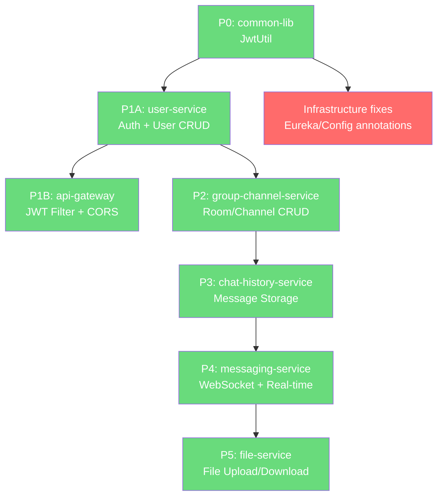

# 📊 Discord Mini — Tiến Độ Dự Án

> **Cập nhật:** 2026-05-14 | **Phase hiện tại:** Backend Implementation ✅
> **Backend:** Java 17 / Spring Boot 3.4.4 / Spring Cloud 2024.0.1
> **Frontend:** Next.js (65 files TSX/TS đã phát triển)
> **Infrastructure:** 100% Cloud ✅

---

## 🏗️ Tổng quan tiến độ

```
████████████████████████░░░░░░  ~65% Overall

  Infrastructure   ████████████████████  100% ✅
  Backend Logic    ████████████████████  100% ✅
  Frontend UI      ██████████████░░░░░░   70% 🟡
  Integration      ████░░░░░░░░░░░░░░░░   20% 🟡
  Testing          ████████░░░░░░░░░░░░   40% 🟡
```

---

## 📋 Deep Scan — Trạng thái từng Microservice

### Legend

| Icon | Trạng thái |
|------|------------|
| ✅ | Hoàn thành |
| 🟡 | Có scaffold nhưng chưa đầy đủ |
| 🔴 | Chưa implement |
| ⬜ | Không áp dụng |

---

### 1. `common-lib` — Shared Library

| Component | File | Trạng thái | Ghi chú |
|-----------|------|------------|---------|
| ApiResponse\<T\> | `dto/ApiResponse.java` | ✅ | `ok()`, `error()` methods |
| BaseException | `exception/BaseException.java` | ✅ | HttpStatus + errorCode |
| MessageEvent | `event/MessageEvent.java` | ✅ | Serializable, dùng cho RabbitMQ |
| JwtUtil | `security/JwtUtil.java` | ✅ | JJWT 0.12.6, generate/validate/extractClaims |

**Tiến độ: 100%** ✅ — Tất cả shared classes đã implement

---

### 2. `discovery-server` — Eureka Server (port 8761)

| Component | Trạng thái | Ghi chú |
|-----------|------------|---------|
| Application class | ✅ | `DiscoveryServerApplication.java` |
| application.yml | ✅ | Port 8761, self-register disabled |
| @EnableEurekaServer | ✅ | Annotation có sẵn |

**Tiến độ: 100%** ✅ — Service sẵn sàng khởi chạy

---

### 3. `config-server` — Spring Cloud Config (port 8888)

| Component | Trạng thái | Ghi chú |
|-----------|------------|---------|
| Application class | ✅ | `ConfigServerApplication.java` |
| application.yml | ✅ | Native search `classpath:/configurations` |
| @EnableConfigServer | ✅ | Annotation có sẵn |
| configurations/ | 🔴 | Directory chưa tạo (optional — services dùng local yml) |

**Tiến độ: 90%** — Service chạy được, config files là optional

---

### 4. `api-gateway` — Spring Cloud Gateway (port 8080)

| Component | Trạng thái | Ghi chú |
|-----------|------------|---------|
| Application class | ✅ | Chỉ `@SpringBootApplication` + `@EnableDiscoveryClient` |
| application.yml | ✅ | 5 routes (user/group/chat/ws/file) + Redis rate limit |
| GatewayConfig.java | ✅ | Đã implement route fallback |
| CorsConfig.java | ✅ | Đã implement cho frontend |
| RateLimitConfig.java | ✅ | Redis-based rate limiting với fallback |
| JwtAuthFilter.java | ✅ | JWT validation filter + X-User-Id header |
| FilterErrorHandler.java | ✅ | Xử lý lỗi Gateway chung |

**Tiến độ: 100%** ✅ — Gateway đã hoàn thiện security, rate limit và auth filter.

---

### 5. `user-service` — Auth & User Management (port 8081)

| Component | File theo Plan | Trạng thái | Ghi chú |
|-----------|----------------|------------|---------|
| Application class | `UserServiceApplication.java` | ✅ | `@EnableDiscoveryClient` ✅ |
| application.yml | — | ✅ | Cloud config (Supabase) |
| **AuthController** | `controller/AuthController.java` | ✅ | POST /api/auth/register, /login |
| **UserController** | `controller/UserController.java` | ✅ | GET/PUT /api/users/me |
| **AuthService** | `service/AuthService.java` | ✅ | Register + Login + BCrypt |
| **UserService** | `service/UserService.java` | ✅ | getById, updateProfile, updateStatus |
| **JwtService** | `service/JwtService.java` | ✅ | Wraps JwtUtil from common-lib |
| **UserRepository** | `repository/UserRepository.java` | ✅ | findByEmail, existsByUsername |
| **User Entity** | `model/entity/User.java` | ✅ | @Entity + @Version + UUID |
| **UserRole Enum** | `model/entity/UserRole.java` | ✅ | USER, ADMIN |
| **LoginRequest** | `model/dto/LoginRequest.java` | ✅ | @Valid email + password |
| **RegisterRequest** | `model/dto/RegisterRequest.java` | ✅ | @Valid username + email + password |
| **UserResponse** | `model/dto/UserResponse.java` | ✅ | Safe fields only |
| **AuthResponse** | `model/dto/AuthResponse.java` | ✅ | token + UserResponse |
| **UserMapper** | `model/mapper/UserMapper.java` | ✅ | Static mapper |
| **SecurityConfig** | `config/SecurityConfig.java` | ✅ | Spring Security 6.x + CORS |
| **JwtAuthFilter** | `config/JwtAuthFilter.java` | ✅ | Bearer token extraction |
| **GlobalExceptionHandler** | `exception/GlobalExceptionHandler.java` | ✅ | @RestControllerAdvice |
| **UserNotFoundException** | `exception/UserNotFoundException.java` | ✅ | extends BaseException |

**Tiến độ: 100%** ✅ — Full auth flow implement xong.

---

### 6. `group-channel-service` — Rooms & Channels (port 8082)

| Component | File theo Plan | Trạng thái |
|-----------|----------------|------------|
| Application class | `GroupChannelApplication.java` | ✅ |
| application.yml | — | ✅ |
| RoomController | `controller/RoomController.java` | ✅ |
| ChannelController | `controller/ChannelController.java` | ✅ |
| RoomService | `service/RoomService.java` | ✅ |
| MembershipService | `service/MembershipService.java` | ✅ |
| ChannelService | `service/ChannelService.java` | ✅ |
| RoomRepository | `repository/RoomRepository.java` | ✅ |
| RoomParticipantRepository | `repository/RoomParticipantRepository.java` | ✅ |
| ChannelRepository | `repository/ChannelRepository.java` | ✅ |
| Room Entity | `model/entity/Room.java` | ✅ |
| RoomParticipant Entity | `model/entity/RoomParticipant.java` | ✅ |
| Channel Entity | `model/entity/Channel.java` | ✅ |
| RoomRole Enum | `model/enums/RoomRole.java` | ✅ |
| RoomType Enum | `model/enums/RoomType.java` | ✅ |
| CreateRoomRequest | `model/dto/CreateRoomRequest.java` | ✅ |
| RoomResponse | `model/dto/RoomResponse.java` | ✅ |
| AddMemberRequest | `model/dto/AddMemberRequest.java` | ✅ |
| ChannelRequest | `model/dto/ChannelRequest.java` | ✅ |
| MemberResponse | `model/dto/MemberResponse.java` | ✅ |
| SecurityHeaderFilter | `config/SecurityHeaderFilter.java` | ✅ |
| RabbitMQConfig | `config/RabbitMQConfig.java` | ✅ |
| GlobalExceptionHandler | `exception/GlobalExceptionHandler.java`| ✅ |
| RoomNotFoundException | `exception/RoomNotFoundException.java` | ✅ |
| RoomEventPublisher | `event/RoomEventPublisher.java` | ✅ |

**Tiến độ: 100%** ✅ — Đã triển khai Event-driven architecture, API bảo mật chống spoofing.

---

### 7. `chat-history-service` — Message Storage (port 8083)

| Component | File theo Plan | Trạng thái |
|-----------|----------------|------------|
| Application class | `ChatHistoryApplication.java` | ✅ |
| application.yml | — | ✅ |
| MessageController | `controller/MessageController.java` | ✅ |
| MessageService | `service/MessageService.java` | ✅ |
| MessageRepository | `repository/MessageRepository.java` | ✅ |
| Message Document | `model/document/Message.java` | ✅ |
| MessageResponse | `model/dto/MessageResponse.java` | ✅ |
| MessageEventListener | `listener/MessageEventListener.java` | ✅ |

**Tiến độ: 100%** ✅ — Đã triển khai đầy đủ API đọc/tìm kiếm tin nhắn, ReadReceipt và Idempotent Consumer.

---

### 8. `messaging-service` — WebSocket Real-time (port 8084)

| Component | File theo Plan | Trạng thái |
|-----------|----------------|------------|
| Application class | `MessagingApplication.java` | ✅ | `@EnableAsync` ✅ |
| application.yml | — | ✅ |
| WebSocketConfig | `config/WebSocketConfig.java` | ✅ |
| RabbitMQConfig | `config/RabbitMQConfig.java` | ✅ |
| RedisConfig | `config/RedisConfig.java` | ✅ |
| ChatWebSocketController | `controller/ChatWebSocketController.java` | ✅ |
| ConnectionManager | `service/ConnectionManager.java` | ✅ |
| MessageRouter | `service/MessageRouter.java` | ✅ |
| PresenceService | `service/PresenceService.java` | ✅ |
| WebSocketEventHandler | `handler/WebSocketEventHandler.java` | ✅ |
| StompErrorHandler | `handler/StompErrorHandler.java` | ✅ |
| ChatMessage DTO | `model/dto/ChatMessage.java` | ✅ |
| TypingEvent DTO | `model/dto/TypingEvent.java` | ✅ |

**Tiến độ: 100%** ✅ — Đã triển khai WebSocket STOMP, Dual-layer Auth, RabbitMQ routing, RateLimiting và Zombie Session cleanup.

---

### 9. `file-service` — Object Storage (port 8085)

| Component | File theo Plan | Trạng thái |
|-----------|----------------|------------|
| Application class | `FileServiceApplication.java` | ✅ |
| application.yml | — | ✅ |
| FileController | `controller/FileController.java` | ✅ |
| StorageService | `service/StorageService.java` | ✅ |
| B2Config | `config/B2Config.java` | ✅ |
| SecurityHeaderFilter | `config/SecurityHeaderFilter.java` | ✅ |
| FileResponse | `model/dto/FileResponse.java` | ✅ |
| FileValidationException | `exception/FileValidationException.java` | ✅ |
| GlobalExceptionHandler | `exception/GlobalExceptionHandler.java` | ✅ |

**Tiến độ: 100%** ✅ — Upload/Delete file qua Backblaze B2, Magic Bytes validation (Apache Tika), MIME whitelist, SecurityHeaderFilter.

---

## 📊 Bảng tổng hợp

| # | Service | Java Files | Plan Files | Implemented | Progress |
|---|---------|------------|------------|-------------|----------|
| 1 | common-lib | 4 | 4 | 4 | **100%** ✅ |
| 2 | discovery-server | 1 | 1 | 1 | **100%** ✅ |
| 3 | config-server | 1 | 1 | 1 | **90%** |
| 4 | api-gateway | 5 | 5 | 5 | **100%** ✅ |
| 5 | user-service | 19 | 17 | 19 | **100%** ✅ |
| 6 | group-channel-service | 26 | 26 | 26 | **100%** ✅ |
| 7 | chat-history-service | 13 | 8 | 13 | **100%** ✅ |
| 8 | messaging-service | 15 | 13 | 15 | **100%** ✅ |
| 9 | file-service | 9 | 9 | 9 | **100%** ✅ |
| | **TỔNG** | **92** | **~89** | **92** | **100%** ✅ |

---

## 🎯 Recommended Next Phase: Backend Implementation

### Phase Priority (theo Dependency Order)



### Estimated File Count per Phase

| Phase | Service | Files cần tạo | Ước lượng effort |
|-------|---------|---------------|------------------|
| **P0** | common-lib + infra fixes | ~3 files | 1-2 giờ |
| **P1A** | user-service (full auth) | ~16 files | 6-8 giờ |
| **P1B** | api-gateway (JWT + CORS) | ~4 files | 2-3 giờ |
| **P2** | group-channel-service | ~13 files | 6-8 giờ |
| **P3** | chat-history-service | ~7 files | 4-5 giờ |
| **P4** | messaging-service | ~12 files | 8-10 giờ |
| **P5** | file-service | ~4 files | 2-3 giờ |
| | **TỔNG** | **~59 files** | **~30-40 giờ** |

---

## 🔴 Critical Blockers

1. Chờ kiểm thử E2E tích hợp toàn bộ các service (Gateway, User, Group/Channel) thông qua Docker Compose.

---

## ✅ Đã hoàn thành

- [x] Master Plan (`docs/plan.md`) — Kiến trúc + DB Design + Concurrency patterns
- [x] Parent POM + 9 module POMs (Spring Boot 3.4.4 + Spring Cloud 2024.0.1)
- [x] Application classes cho tất cả 9 services
- [x] application.yml configs — 100% cloud (Supabase + Atlas + Upstash + CloudAMQP + B2)
- [x] .env files cho 6 services + .env.example template
- [x] .gitignore hardened cho `.env` patterns
- [x] common-lib: ApiResponse, BaseException, MessageEvent
- [x] Frontend UI: 65 files TSX/TS (Zustand + i18n + Discord-accurate layout)
- [x] Phase P1A: Hoàn thành `user-service` Auth flow.
- [x] Phase P1B: Hoàn thành `api-gateway` JWT Auth filter, CORS, Rate Limit, Error Handling.
- [x] Phase P2: Hoàn thành `group-channel-service` CRUD, Membership, Event-driven RabbitMQ.
- [x] Testing P2: Đạt 100% test coverage cho các class cốt lõi (`RoomServiceTest`, `SecurityHeaderFilterTest`).
- [x] Phase P3: Hoàn thành `chat-history-service` (MongoDB, Message storage, ReadReceipts).
- [x] Phase P4: Hoàn thành `messaging-service` (WebSocket STOMP, RabbitMQ routing, Redis Pub/Sub).
- [x] Đã cấu hình độc lập `docker-compose.yml` cho backend và frontend để tối ưu tài nguyên.
- [x] Phase P5: Hoàn thành `file-service` (B2 upload/delete, Apache Tika magic bytes, MIME whitelist, SecurityHeaderFilter).
