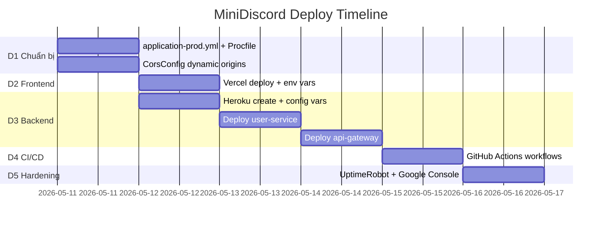

# 🚀 MiniDiscord — Deployment Plan (v2 — Heroku Edition)

> **Cập nhật dựa trên review:** Heroku Eco Dynos · Loại bỏ Eureka cho MVP · Public repo CI/CD

---

## Đánh giá sẵn sàng Deploy

### Hiện trạng dự án (~48% Backend)

| Thành phần | Trạng thái | Deploy MVP? |
|-----------|-----------|------------|
| **Frontend (Next.js)** | 70% UI, Auth flow hoạt động | ✅ |
| **API Gateway** | 100% (JWT, CORS, Rate Limit) | ✅ |
| **User Service** | 100% (Auth + Google OAuth) | ✅ |
| **Eureka Server** | 100% | ⏭️ Bỏ qua cho MVP |
| **Group Channel / Chat / Messaging / File** | 10% scaffold | ❌ Deploy khi implement xong |

> [!IMPORTANT]
> **MVP Scope:** Frontend + API Gateway + User Service. Đủ demo luồng Đăng ký → Đăng nhập (Email/Google) → Dashboard → Logout.

---

## Quyết định Kiến trúc (Đã xác nhận từ Review)

### ✅ Q1: Nền tảng Backend → Heroku Eco Dynos ($5/tháng)

| Tiêu chí | Chi tiết |
|----------|---------|
| **Gói** | Eco Dynos — $5/tháng, 1000 giờ chung toàn account |
| **Quota** | 2 apps × ~500h (sleep mode) ≈ vừa đủ 1000h/tháng |
| **Cold start** | ~10-20s sau 30 phút idle. Chấp nhận được cho MVP/demo |
| **Deploy method** | Git push (Heroku Buildpack Java/Maven) — nhẹ hơn Docker |

### ✅ Q2: Loại bỏ Eureka → Direct URL Routing

> [!WARNING]
> **Thay đổi kiến trúc quan trọng:** Eureka không phù hợp trên Heroku Common Runtime do IP Dyno thay đổi liên tục. Chuyển sang Direct URL qua env vars.

**Trước (Local Docker):**
```
Gateway → Eureka → lb://USER-SERVICE → user-service container
```

**Sau (Heroku Production):**
```
Gateway → https://minidiscord-user.herokuapp.com (Direct URL)
```

**Lợi ích:** Tiết kiệm 1 Dyno (Eureka), giảm nguy cơ cạn 1000h quota.

### ✅ Q3: CI/CD → GitHub Actions Unlimited (Public Repo)

Pipeline đầy đủ: Build → Test → Deploy to Heroku. Không giới hạn minutes.

---

## Kiến trúc Production (Đã cập nhật)

```
┌──────────────────────────────────────────────────────┐
│                    PRODUCTION                         │
├──────────────────────────────────────────────────────┤
│                                                       │
│  Frontend (Vercel - FREE)                            │
│  ├── Domain: minidiscord.vercel.app                  │
│  ├── Next.js SSR + Edge CDN                          │
│  ├── Auto deploy từ GitHub (push to main)            │
│  └── Env: NEXT_PUBLIC_API_URL → Heroku Gateway       │
│                                                       │
│  Backend (Heroku Eco - $5/tháng)                     │
│  ├── minidiscord-gateway   (API Gateway + JWT)       │
│  │   └── Routes trỏ trực tiếp → user-service URL    │
│  └── minidiscord-user      (Auth + User CRUD)        │
│      └── Kết nối trực tiếp → Supabase PostgreSQL     │
│                                                       │
│  ❌ Eureka Server: KHÔNG deploy (MVP optimization)    │
│                                                       │
│  Database & Infra (Cloud - ĐÃ CÓ SẴN)              │
│  ├── PostgreSQL       → Supabase (ap-southeast-2)    │
│  ├── Redis            → Upstash (Rate Limiting)      │
│  └── (MongoDB, RabbitMQ, B2 → khi P2-P5 implement)  │
│                                                       │
└──────────────────────────────────────────────────────┘
```

---

## Proposed Changes

### Phase D1: Chuẩn bị Codebase cho Production (~3 giờ)

---

#### [NEW] `backend/api-gateway/src/main/resources/application-prod.yml`

Tạo profile `prod` cho Gateway — loại bỏ Eureka, dùng Direct URL routing:

```yaml
# === PRODUCTION PROFILE ===
# Eureka disabled — Direct URL routing to Heroku apps
spring:
  cloud:
    gateway:
      routes:
        - id: user-service
          uri: ${USER_SERVICE_URL:https://minidiscord-user.herokuapp.com}
          predicates:
            - Path=/api/auth/**, /api/users/**
          filters:
            - name: RequestRateLimiter
              args:
                redis-rate-limiter.replenishRate: 10
                redis-rate-limiter.burstCapacity: 20
    discovery:
      enabled: false  # Tắt Eureka discovery
  data:
    redis:
      host: ${SPRING_DATA_REDIS_HOST}      # Upstash Redis
      port: ${SPRING_DATA_REDIS_PORT:6379}
      password: ${SPRING_DATA_REDIS_PASSWORD}
      ssl:
        enabled: true  # Upstash yêu cầu TLS

eureka:
  client:
    enabled: false   # Không đăng ký với Eureka

server:
  port: ${PORT:8080}  # Heroku cấp PORT động

# CORS cho production frontend (hỗ trợ Vercel Preview URLs)
app:
  cors:
    allowed-origins: ${CORS_ORIGINS:https://minidiscord.vercel.app}
    allowed-origin-patterns: ${CORS_ORIGIN_PATTERNS:https://*.vercel.app}
```

#### [NEW] `backend/user-service/src/main/resources/application-prod.yml`

```yaml
# === PRODUCTION PROFILE ===
spring:
  datasource:
    url: ${SPRING_DATASOURCE_URL}  # Inject từ Heroku Config Vars
    username: ${SPRING_DATASOURCE_USERNAME}
    password: ${SPRING_DATASOURCE_PASSWORD}
  jpa:
    hibernate:
      ddl-auto: update # Tự động update schema (khởi tạo bảng trên Supabase lần đầu)

eureka:
  client:
    enabled: false  # Không cần Eureka trên production

server:
  port: ${PORT:8081}  # Heroku cấp PORT động
```

#### [MODIFY] [CorsConfig.java](file:///e:/UIT/MiniDiscord/backend/api-gateway/src/main/java/com/discordmini/gateway/config/CorsConfig.java)

- Đọc allowed origins từ env var `CORS_ORIGINS` thay vì hardcode `localhost:3000`.
- Hỗ trợ cả local dev lẫn production trong cùng 1 config.
- **Hỗ trợ Vercel Preview URLs:** Thêm `allowedOriginPatterns` dạng `https://*.vercel.app` để test API trên các bản preview động của Vercel (ví dụ: `minidiscord-git-feature-x.vercel.app`).

#### [MODIFY] [next.config.ts](file:///e:/UIT/MiniDiscord/frontend/next.config.ts)

- Thêm `output: "standalone"` cho production build.

#### [MODIFY] [Dockerfile (frontend)](file:///e:/UIT/MiniDiscord/frontend/Dockerfile)

- Chuyển từ `npm run dev` → multi-stage build `npm run build` + `npm start`.

#### [NEW] `backend/api-gateway/Procfile`

```
web: java -Dspring.profiles.active=prod -Dserver.port=$PORT -jar target/*.jar
```

#### [NEW] `backend/user-service/Procfile`

```
web: java -Dspring.profiles.active=prod -Dserver.port=$PORT -jar target/*.jar
```

---

### Phase D2: Frontend Deploy → Vercel (~30 phút)

| Bước | Hành động |
|------|----------|
| 1 | Vercel Dashboard → Import Git Repository → chọn `MiniDiscord` |
| 2 | Root Directory: `frontend/` |
| 3 | Framework Preset: `Next.js` (auto-detect) |
| 4 | Environment Variables: `NEXT_PUBLIC_API_URL=https://minidiscord-gateway.herokuapp.com/api` |
| 5 | Environment Variables: `NEXT_PUBLIC_GOOGLE_CLIENT_ID=905392681989-...` |
| 6 | Deploy → Kiểm tra URL |
| 7 | Google Cloud Console → thêm Vercel domain vào Authorized Origins |

---

### Phase D3: Backend Deploy → Heroku (~3 giờ)

#### Bước 1: Tạo Heroku Apps

```bash
heroku login
heroku create minidiscord-gateway
heroku create minidiscord-user
```

#### Bước 2: Cấu hình User Service

```bash
# Trỏ đến đúng thư mục con trong monorepo
heroku buildpacks:set heroku/java -a minidiscord-user

# Config Vars (lấy từ file .env hiện có)
heroku config:set \
  SPRING_PROFILES_ACTIVE=prod \
  SPRING_DATASOURCE_URL=jdbc:postgresql://... \
  SPRING_DATASOURCE_USERNAME=... \
  SPRING_DATASOURCE_PASSWORD=... \
  JWT_SECRET=... \
  GOOGLE_CLIENT_ID=905392681989-... \
  -a minidiscord-user
```

#### Bước 3: Cấu hình API Gateway

```bash
heroku buildpacks:set heroku/java -a minidiscord-gateway

heroku config:set \
  SPRING_PROFILES_ACTIVE=prod \
  USER_SERVICE_URL=https://minidiscord-user.herokuapp.com \
  JWT_SECRET=... \
  CORS_ORIGINS=https://minidiscord.vercel.app \
  CORS_ORIGIN_PATTERNS=https://*.vercel.app \
  SPRING_DATA_REDIS_HOST=<upstash-host>.upstash.io \
  SPRING_DATA_REDIS_PORT=6379 \
  SPRING_DATA_REDIS_PASSWORD=<upstash-password> \
  -a minidiscord-gateway
```

> [!IMPORTANT]
> **Redis là bắt buộc cho Gateway.** `RequestRateLimiter` của Spring Cloud Gateway cần Redis để đếm request. Nếu thiếu các biến `SPRING_DATA_REDIS_*`, Gateway sẽ crash ngay khi khởi động do không kết nối được `localhost:6379`.

#### Bước 4: Deploy

```bash
# Dùng git subtree hoặc Heroku Multi-Procfile buildpack
# Option A: Deploy từng service bằng git subtree
git subtree push --prefix backend/user-service heroku-user main
git subtree push --prefix backend/api-gateway heroku-gateway main

# Option B: Dùng GitHub Actions (Phase D4)
```

> [!WARNING]
> **Lưu ý quan trọng về Monorepo:** Heroku mặc định deploy từ root. Vì project là monorepo, cần dùng `heroku-buildpack-multi-procfile` hoặc deploy qua GitHub Actions (đề xuất ở D4).

---

### Phase D4: CI/CD Pipeline — GitHub Actions (~2 giờ)

> [!IMPORTANT]
> **Option B (đã chọn):** Build `.jar` trên GitHub Actions → Deploy bằng `heroku deploy:jar` (Heroku CLI plugin). Heroku **KHÔNG build lại** từ source, nhận thẳng file `.jar` đã sẵn sàng → deploy nhanh hơn ~3-5 phút so với buildpack.

#### [NEW] `.github/workflows/deploy-backend.yml`

```yaml
name: Deploy Backend to Heroku
on:
  push:
    branches: [main]
    paths:
      - 'backend/api-gateway/**'
      - 'backend/user-service/**'
      - 'backend/common-lib/**'

jobs:
  deploy-user-service:
    runs-on: ubuntu-latest
    steps:
      - uses: actions/checkout@v4

      - name: Set up JDK 17
        uses: actions/setup-java@v4
        with:
          java-version: '17'
          distribution: 'temurin'
          cache: maven

      - name: Build User Service JAR
        working-directory: backend
        run: mvn -pl common-lib,user-service -am clean package -DskipTests -q

      - name: Install Heroku CLI + Java Plugin
        run: |
          curl https://cli-assets.heroku.com/install.sh | sh
          heroku plugins:install java

      - name: Deploy JAR to Heroku
        env:
          HEROKU_API_KEY: ${{ secrets.HEROKU_API_KEY }}
        run: |
          heroku deploy:jar backend/user-service/target/*.jar \
            --app minidiscord-user \
            --jdk 17 \
            --options "-Dspring.profiles.active=prod -Dserver.port=\$PORT"

  deploy-api-gateway:
    runs-on: ubuntu-latest
    needs: deploy-user-service
    steps:
      - uses: actions/checkout@v4

      - name: Set up JDK 17
        uses: actions/setup-java@v4
        with:
          java-version: '17'
          distribution: 'temurin'
          cache: maven

      - name: Build API Gateway JAR
        working-directory: backend
        run: mvn -pl common-lib,api-gateway -am clean package -DskipTests -q

      - name: Install Heroku CLI + Java Plugin
        run: |
          curl https://cli-assets.heroku.com/install.sh | sh
          heroku plugins:install java

      - name: Deploy JAR to Heroku
        env:
          HEROKU_API_KEY: ${{ secrets.HEROKU_API_KEY }}
        run: |
          heroku deploy:jar backend/api-gateway/target/*.jar \
            --app minidiscord-gateway \
            --jdk 17 \
            --options "-Dspring.profiles.active=prod -Dserver.port=\$PORT"
```

> [!TIP]
> **Tại sao Option B tốt hơn?**
> - ❌ Option A: GitHub push source → Heroku Buildpack build lại từ đầu (~5-8 phút)
> - ✅ Option B: GitHub build `.jar` → `heroku deploy:jar` upload trực tiếp (~1-2 phút deploy)
> - Tổng thời gian pipeline giảm từ ~10 phút xuống ~5 phút

#### [NEW] `.github/workflows/test.yml`

```yaml
name: Run Tests
on:
  pull_request:
    branches: [main]

jobs:
  backend-tests:
    runs-on: ubuntu-latest
    steps:
      - uses: actions/checkout@v4
      - uses: actions/setup-java@v4
        with:
          java-version: '17'
          distribution: 'temurin'
          cache: maven
      - name: Run Tests
        working-directory: backend
        run: mvn clean test -q

  frontend-lint:
    runs-on: ubuntu-latest
    steps:
      - uses: actions/checkout@v4
      - uses: actions/setup-node@v4
        with:
          node-version: '22'
          cache: 'npm'
          cache-dependency-path: frontend/package-lock.json
      - name: Install & Lint
        working-directory: frontend
        run: |
          npm ci --legacy-peer-deps
          npm run lint
          npm run build
```

#### GitHub Secrets cần thiết lập

| Secret | Nguồn |
|--------|-------|
| `HEROKU_API_KEY` | Heroku Dashboard → Account Settings → API Key |

---

### Phase D5: Production Hardening (~2 giờ)

| Task | Chi tiết |
|------|---------|
| **Health checks** | Spring Boot Actuator `/actuator/health` (đã có sẵn) |
| **HTTPS** | Heroku tự cấp SSL. Vercel tự cấp SSL |
| **Secrets** | Tất cả credentials nằm trong Heroku Config Vars, KHÔNG commit `.env` |
| **Logging** | `heroku logs --tail -a minidiscord-gateway` |
| **Google Console** | Thêm production domain vào Authorized Origins |
| **Monitoring** | UptimeRobot (free) — **CHỈ bật vào ngày demo** (xem cảnh báo bên dưới) |

> [!CAUTION]
> **Cảnh báo Quota UptimeRobot:**
> Nếu UptimeRobot ping 24/7 khiến **cả 2 Dynos thức liên tục**:
> - `2 apps × 24h × 30 ngày = 1440 giờ/tháng`
> - Heroku Eco chỉ cấp **1000 giờ/tháng** → **hệ thống sẽ sập vào tuần thứ 3**
>
> **Chiến lược đúng:**
> 1. **Ngày thường:** Để Dynos tự sleep sau 30 phút. Chấp nhận cold start ~15s.
> 2. **Ngày demo/báo cáo:** Bật UptimeRobot ping mỗi 25 phút trước buổi demo 1 giờ → tắt sau khi demo xong.
> 3. **Giờ làm việc:** Có thể cấu hình UptimeRobot chỉ ping từ 8:00-22:00 (14h/ngày × 2 dynos × 30 ngày = 840h ≤ 1000h quota).

---

## Lộ trình tổng thể



| Phase | Effort | Ngày |
|-------|--------|------|
| D1: Chuẩn bị codebase | ~3 giờ | Ngày 1 |
| D2: Frontend → Vercel | ~30 phút | Ngày 1 |
| D3: Backend → Heroku | ~3 giờ | Ngày 1-2 |
| D4: CI/CD GitHub Actions | ~2 giờ | Ngày 2 |
| D5: Hardening | ~2 giờ | Ngày 3 |
| **TỔNG** | **~10 giờ** | **~3 ngày** |

---

## Verification Plan

### Automated Tests
```bash
# Backend
cd backend && mvn clean test

# Frontend
cd frontend && npm run build
```

### Manual Verification (Post-Deploy)
1. ✅ Mở Vercel URL → Trang login hiển thị
2. ✅ Đăng ký tài khoản → Redirect dashboard
3. ✅ Đăng nhập → Dashboard hiển thị user info thật
4. ✅ Logout → Redirect về login
5. ✅ Google OAuth → Hoạt động (cần update Google Console)
6. ✅ Refresh page → Session persist
7. ✅ Gateway health: `https://minidiscord-gateway.herokuapp.com/actuator/health`
8. ✅ Cold start test: Đợi 35 phút → gửi request → verify wakeup < 20s
